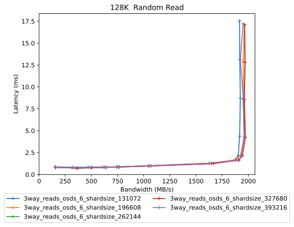
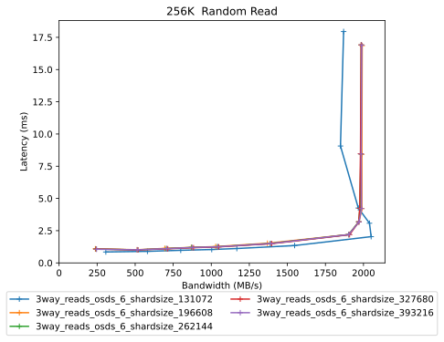
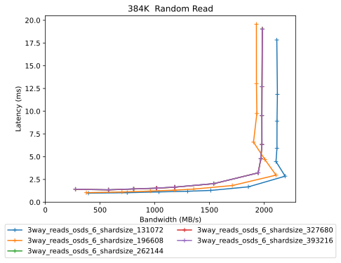
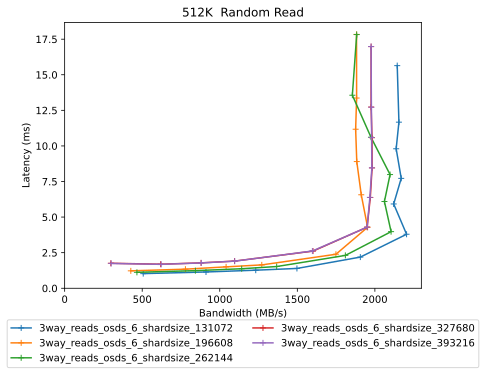
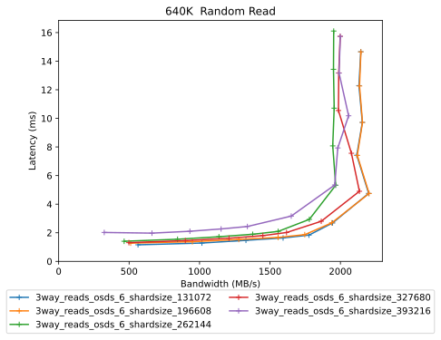
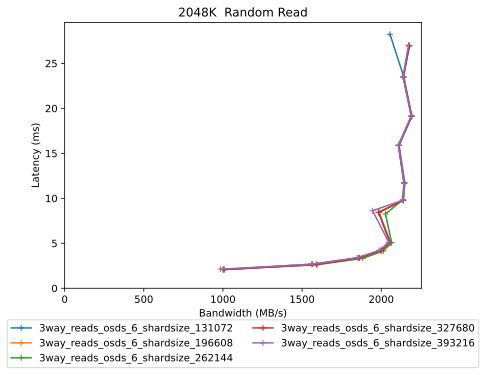

Comparitive Performance Report for 3way-reads-osds-6-shardsize-131072 vs 3way-reads-osds-6-shardsize-196608 vs 3way-reads-osds-6-shardsize-262144 vs 3way-reads-osds-6-shardsize-327680 vs 3way-reads-osds-6-shardsize-393216
=============================================================================================================================================================================================================================

Table of contents
=================

* [Comparison summary for 3way-reads-osds-6-shardsize-131072 vs 3way-reads-osds-6-shardsize-196608 vs 3way-reads-osds-6-shardsize-262144 vs 3way-reads-osds-6-shardsize-327680 vs 3way-reads-osds-6-shardsize-393216](#comparison-summary-for-3way-reads-osds-6-shardsize-131072-vs-3way-reads-osds-6-shardsize-196608-vs-3way-reads-osds-6-shardsize-262144-vs-3way-reads-osds-6-shardsize-327680-vs-3way-reads-osds-6-shardsize-393216)
* [Response Curves](#response-curves)
	* [Random Read](#random-read)
* [Configuration yaml files](#configuration-yaml-files)
	* [results](#results)

# Comparison summary for 3way-reads-osds-6-shardsize-131072 vs 3way-reads-osds-6-shardsize-196608 vs 3way-reads-osds-6-shardsize-262144 vs 3way-reads-osds-6-shardsize-327680 vs 3way-reads-osds-6-shardsize-393216
  
  
  
|Random Read|3way_reads_osds_6_shardsize_131072|3way_reads_osds_6_shardsize_196608|%change|3way_reads_osds_6_shardsize_262144|%change|3way_reads_osds_6_shardsize_327680|%change|3way_reads_osds_6_shardsize_393216|%change|  
| :--- | ---: | ---: | ---: | ---: | ---: | ---: | ---: | ---: | ---: |  
|[128K](#131072-randread)|1925@8.7ms|1964@4.3|2%|1971@4.2|2%|1973@4.2|2%|1960@4.3|2%|  
|[256K](#262144-randread)|2050@2.0ms|1992@16.9|-3%|1985@16.9|-3%|1984@16.9|-3%|1989@16.9|-3%|  
|[384K](#393216-randread)|2193@2.9ms|2109@3.0|-4%|1982@19.1|-10%|1985@19.0|-9%|1985@19.0|-9%|  
|[512K](#524288-randread)|2204@3.8ms|1953@4.3|-11%|2104@4.0|-5%|1982@8.5|-10%|1981@8.5|-10%|  
|[640K](#655360-randread)|2200@4.8ms|2203@4.7|0%|1966@5.3|-11%|2135@4.9|-3%|2058@10.2|-6%|  
|[768K](#786432-randread)|2179@8.7ms|2181@8.6|0%|2176@8.7|-0%|2019@9.3|-7%|2091@4.5|-4%|  
|[1024K](#1048576-randread)|2181@9.6ms|2180@9.6|-0%|2180@9.6|-0%|2178@9.6|-0%|1974@6.4|-9%|  
|[1280K](#1310720-randread)|2181@12.0ms|2177@12.0|-0%|2259@11.6|4%|2160@12.1|-1%|2167@12.1|-1%|  
|[1536K](#1572864-randread)|2180@14.4ms|2178@14.4|-0%|2179@14.4|-0%|2168@14.5|-1%|2165@14.5|-1%|  
|[2048K](#2097152-randread)|2192@19.1ms|2191@19.1|-0%|2193@19.1|0%|2192@19.1|0%|2189@19.1|-0%|  
  
  
  

# Response Curves

## Random Read

|||
| :---: | :---: |
|<a name="131072-randread"></a>|<a name="262144-randread"></a>|
|<a name="393216-randread"></a>|<a name="524288-randread"></a>|
|<a name="655360-randread"></a>|<a name="786432-randread"></a>|
|<a name="1048576-randread"></a>|<a name="1310720-randread"></a>|
|<a name="1572864-randread"></a>|<a name="2097152-randread"></a>|

# Configuration yaml files


Only yaml files that differ by more than 20 lines from the yaml file for the baseline directory will be added here in addition to the baseline yaml  

## results


```benchmarks:
  librbdfio:
    cmd_path: /usr/local/bin/fio2
    create_report: true
    fio_out_format: json
    log_avg_msec: 100
    log_bw: true
    log_iops: true
    log_lat: true
    norandommap: true
    osd_ra:
    - 4096
    poolname: rbd_replicated
    prefill:
      blocksize: 64k
      numjobs: 1
    procs_per_volume:
    - 1
    ramp: 20
    rbdname: cbt-librbdfio
    time: 60
    time_based: true
    use_existing_volumes: true
    vol_size: 1000
    volumes_per_client:
    - 8
    wait_pgautoscaler_timeout: 10
    workloads:
      1280krandomread:
        jobname: randread
        mode: randread
        numjobs:
        - 1
        op_size: 1310720
        total_iodepth:
        - 1
        - 2
        - 3
        - 4
        - 5
        - 8
        - 12
        - 16
        - 20
        - 24
        - 28
        - 32
        - 40
      128krandomread:
        jobname: randread
        mode: randread
        numjobs:
        - 1
        op_size: 131072
        total_iodepth:
        - 1
        - 2
        - 3
        - 4
        - 5
        - 8
        - 16
        - 24
        - 32
        - 64
        - 128
        - 192
        - 256
      1536krandomread:
        jobname: randread
        mode: randread
        numjobs:
        - 1
        op_size: 1572864
        total_iodepth:
        - 1
        - 2
        - 3
        - 4
        - 5
        - 8
        - 10
        - 12
        - 16
        - 20
        - 24
        - 28
        - 32
      1Mrandomread:
        jobname: randread
        mode: randread
        numjobs:
        - 1
        op_size: 1048576
        total_iodepth:
        - 1
        - 2
        - 3
        - 4
        - 5
        - 8
        - 12
        - 16
        - 20
        - 24
        - 28
        - 32
        - 40
      256krandomread:
        jobname: randread
        mode: randread
        numjobs:
        - 1
        op_size: 262144
        total_iodepth:
        - 1
        - 2
        - 3
        - 4
        - 5
        - 8
        - 16
        - 24
        - 32
        - 64
        - 128
      2Mrandomread:
        jobname: randread
        mode: randread
        numjobs:
        - 1
        op_size: 2097152
        total_iodepth:
        - 1
        - 2
        - 3
        - 4
        - 5
        - 8
        - 10
        - 12
        - 16
        - 20
        - 24
        - 28
      384krandomread:
        jobname: randread
        mode: randread
        numjobs:
        - 1
        op_size: 393216
        total_iodepth:
        - 1
        - 2
        - 3
        - 4
        - 5
        - 8
        - 16
        - 24
        - 32
        - 48
        - 64
        - 96
      512krandomread:
        jobname: randread
        mode: randread
        numjobs:
        - 1
        op_size: 524288
        total_iodepth:
        - 1
        - 2
        - 3
        - 4
        - 8
        - 16
        - 24
        - 32
        - 40
        - 48
        - 64
      640krandomread:
        jobname: randread
        mode: randread
        numjobs:
        - 1
        op_size: 655360
        total_iodepth:
        - 1
        - 2
        - 3
        - 4
        - 5
        - 8
        - 16
        - 24
        - 32
        - 40
        - 48
      768krandomread:
        jobname: randread
        mode: randread
        numjobs:
        - 1
        op_size: 786432
        total_iodepth:
        - 1
        - 2
        - 3
        - 4
        - 5
        - 8
        - 12
        - 16
        - 24
        - 32
        - 40
        - 48
cluster:
  archive_dir: /tmp/cbt
  ceph-mgr_cmd: /usr/bin/ceph-mgr
  ceph-mon_cmd: /usr/bin/ceph-mon
  ceph-osd_cmd: /usr/bin/ceph-osd
  ceph-run_cmd: /usr/bin/ceph-run
  ceph_cmd: /usr/bin/ceph
  clients:
  - --- server1 ---
  clusterid: ceph
  conf_file: /cbt/ceph.conf.4x1x1.fs
  fs: xfs
  head: --- server1 ---
  iterations: 1
  mgrs:
    --- server1 ---:
      a: null
  mkfs_opts: -f -i size=2048
  mons:
    --- server1 ---:
      a: --- IP Address --:6789
  mount_opts: -o inode64,noatime,logbsize=256k
  osds:
  - --- server1 ---
  osds_per_node: 6
  pdsh_ssh_args: -a -x -l%u %h
  rados_cmd: /usr/bin/rados
  rbd_cmd: /usr/bin/rbd
  tmp_dir: /tmp/cbt
  use_existing: true
  user: root
monitoring_profiles:
  collectl:
    args: -c 18 -sCD -i 10 -P -oz -F0 --rawtoo --sep ";" -f {collectl_dir}
```

```benchmarks:
  librbdfio:
    cmd_path: /usr/local/bin/fio2
    create_report: true
    fio_out_format: json
    log_avg_msec: 100
    log_bw: true
    log_iops: true
    log_lat: true
    norandommap: true
    osd_ra:
    - 4096
    poolname: rbd_replicated
    prefill:
      blocksize: 64k
      numjobs: 1
    procs_per_volume:
    - 1
    ramp: 20
    rbdname: cbt-librbdfio
    time: 60
    time_based: true
    use_existing_volumes: true
    vol_size: 1000
    volumes_per_client:
    - 8
    wait_pgautoscaler_timeout: 10
    workloads:
      1280krandomread:
        jobname: randread
        mode: randread
        numjobs:
        - 1
        op_size: 1310720
        total_iodepth:
        - 1
        - 2
        - 3
        - 4
        - 5
        - 8
        - 12
        - 16
        - 20
        - 24
        - 28
        - 32
        - 40
      128krandomread:
        jobname: randread
        mode: randread
        numjobs:
        - 1
        op_size: 131072
        total_iodepth:
        - 1
        - 2
        - 3
        - 4
        - 5
        - 8
        - 16
        - 24
        - 32
        - 64
        - 128
        - 192
        - 256
      1536krandomread:
        jobname: randread
        mode: randread
        numjobs:
        - 1
        op_size: 1572864
        total_iodepth:
        - 1
        - 2
        - 3
        - 4
        - 5
        - 8
        - 10
        - 12
        - 16
        - 20
        - 24
        - 28
        - 32
      1Mrandomread:
        jobname: randread
        mode: randread
        numjobs:
        - 1
        op_size: 1048576
        total_iodepth:
        - 1
        - 2
        - 3
        - 4
        - 5
        - 8
        - 12
        - 16
        - 20
        - 24
        - 28
        - 32
        - 40
      256krandomread:
        jobname: randread
        mode: randread
        numjobs:
        - 1
        op_size: 262144
        total_iodepth:
        - 1
        - 2
        - 3
        - 4
        - 5
        - 8
        - 16
        - 24
        - 32
        - 64
        - 128
      2Mrandomread:
        jobname: randread
        mode: randread
        numjobs:
        - 1
        op_size: 2097152
        total_iodepth:
        - 1
        - 2
        - 3
        - 4
        - 5
        - 8
        - 10
        - 12
        - 16
        - 20
        - 24
        - 28
      384krandomread:
        jobname: randread
        mode: randread
        numjobs:
        - 1
        op_size: 393216
        total_iodepth:
        - 1
        - 2
        - 3
        - 4
        - 5
        - 8
        - 16
        - 24
        - 32
        - 48
        - 64
        - 96
      512krandomread:
        jobname: randread
        mode: randread
        numjobs:
        - 1
        op_size: 524288
        total_iodepth:
        - 1
        - 2
        - 3
        - 4
        - 8
        - 16
        - 24
        - 32
        - 40
        - 48
        - 64
      640krandomread:
        jobname: randread
        mode: randread
        numjobs:
        - 1
        op_size: 655360
        total_iodepth:
        - 1
        - 2
        - 3
        - 4
        - 5
        - 8
        - 16
        - 24
        - 32
        - 40
        - 48
      768krandomread:
        jobname: randread
        mode: randread
        numjobs:
        - 1
        op_size: 786432
        total_iodepth:
        - 1
        - 2
        - 3
        - 4
        - 5
        - 8
        - 12
        - 16
        - 24
        - 32
        - 40
        - 48
cluster:
  archive_dir: /tmp/cbt
  ceph-mgr_cmd: /usr/bin/ceph-mgr
  ceph-mon_cmd: /usr/bin/ceph-mon
  ceph-osd_cmd: /usr/bin/ceph-osd
  ceph-run_cmd: /usr/bin/ceph-run
  ceph_cmd: /usr/bin/ceph
  clients:
  - --- server1 ---
  clusterid: ceph
  conf_file: /cbt/ceph.conf.4x1x1.fs
  fs: xfs
  head: --- server1 ---
  iterations: 1
  mgrs:
    --- server1 ---:
      a: null
  mkfs_opts: -f -i size=2048
  mons:
    --- server1 ---:
      a: --- IP Address --:6789
  mount_opts: -o inode64,noatime,logbsize=256k
  osds:
  - --- server1 ---
  osds_per_node: 6
  pdsh_ssh_args: -a -x -l%u %h
  rados_cmd: /usr/bin/rados
  rbd_cmd: /usr/bin/rbd
  tmp_dir: /tmp/cbt
  use_existing: true
  user: root
monitoring_profiles:
  collectl:
    args: -c 18 -sCD -i 10 -P -oz -F0 --rawtoo --sep ";" -f {collectl_dir}
```