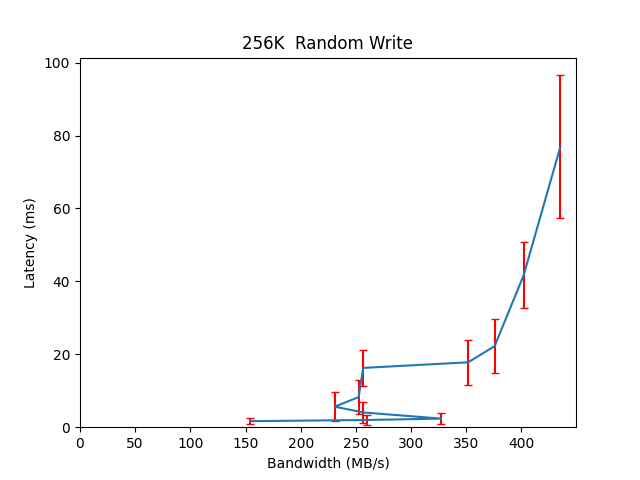

Performance Report for cbt_12thDec_alexls10_4k
==============================================

Contents
========

* [Performance Report](#performance-report)
	* [Summary of results](#summary-of-results)
	* [Response Curves](#response-curves)

# Performance Report

## Summary of results

|Workload Name|Maximum Throughput|Latency (ms)|
| :--- | :--- | :--- |
|65536B_randwrite|210.2274 MB/s|39.8790|
|1048576B_randwrite|476.5508 MB/s|43.7105|
|8192B_randwrite|5819.4169 IOps|21.9824|
|524288B_randwrite|503.3647 MB/s|16.4862|
|4096B_randwrite|5680.7770 IOps|22.5180|
|16384B_randwrite|5258.8037 IOps|12.1550|
|262144B_randwrite|435.4579 MB/s|77.0336|
|32768B_randwrite|3520.1626 IOps|36.3438|
|65536B_70_30_randrw|311.4786 MB/s|13.4548|
|16384B_70_30_randrw|8066.8111 IOps|15.8851|
|65536B_30_70_randrw|249.3230 MB/s|33.6459|
|65536B_randread|1614.9420 MB/s|10.3840|
|524288B_randread|1693.4618 MB/s|14.8551|
|32768B_randread|30501.2663 IOps|8.3894|
|262144B_randread|1673.1162 MB/s|20.0595|
|1048576B_randread|1707.2292 MB/s|19.6496|
|8192B_randread|58362.5473 IOps|6.5752|
|16384B_randread|33736.9797 IOps|11.3810|
|4096B_randread|93476.3095 IOps|4.1047|
|4096B_read|24691.0542 IOps|7.7722|
|32768B_read|10909.0773 IOps|17.5922|
|16384B_read|11076.2003 IOps|17.3279|
|8192B_read|16352.3168 IOps|11.7374|
|524288B_read|1498.2989 MB/s|11.1922|
|65536B_read|970.5708 MB/s|17.2834|
|262144B_read|1474.4688 MB/s|11.3734|
|1048576B_read|1522.3868 MB/s|13.7695|
|8192B_write|3653.6963 IOps|70.0108|
|65536B_write|201.1409 MB/s|41.7026|
|524288B_write|471.3708 MB/s|35.4521|
|4096B_write|3960.8202 IOps|64.5996|
|16384B_write|4777.9295 IOps|40.1654|
|32768B_write|5387.0823 IOps|23.7376|
|262144B_write|531.5445 MB/s|3.8975|
|1048576B_write|495.9151 MB/s|20.8515|

## Response Curves

|||
| :---: | :---: |
|{ width=50% }|{ width=50% }|
|{ width=50% }|{ width=50% }|
|{ width=50% }|{ width=50% }|
|{ width=50% }|{ width=50% }|
|{ width=50% }|{ width=50% }|
|{ width=50% }|{ width=50% }|
|{ width=50% }|{ width=50% }|
|{ width=50% }|{ width=50% }|
|{ width=50% }|{ width=50% }|
|{ width=50% }|{ width=50% }|
|{ width=50% }|{ width=50% }|
|{ width=50% }|{ width=50% }|
|{ width=50% }|{ width=50% }|
|{ width=50% }|{ width=50% }|
|{ width=50% }|{ width=50% }|
|{ width=50% }|{ width=50% }|
|{ width=50% }|{ width=50% }|
|{ width=50% }||
