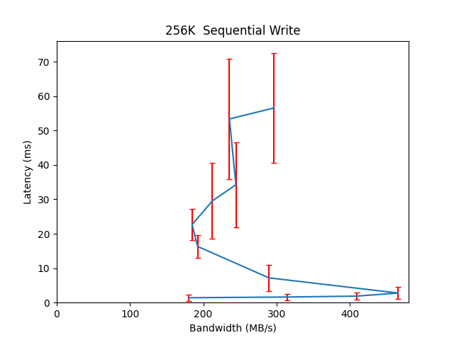
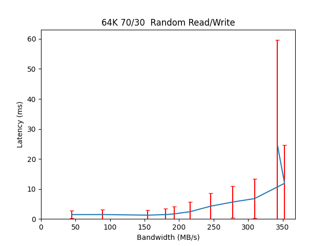

Performance Report for cbt_15thDec_alexls10_32k
===============================================

Contents
========

* [Performance Report](#performance-report)
	* [Summary of results](#summary-of-results)
	* [Response Curves](#response-curves)

# Performance Report

## Summary of results

|Workload Name|Maximum Throughput|Latency (ms)|
| :--- | :--- | :--- |
|262144B_read|1571.8812 MB/s|10.6685|
|1048576B_read|1595.5733 MB/s|13.1380|
|4096B_read|25287.0640 IOps|7.5893|
|65536B_read|1391.0460 MB/s|12.0573|
|524288B_read|1591.8915 MB/s|10.5374|
|32768B_read|26846.4781 IOps|7.1474|
|8192B_read|22920.8759 IOps|8.3727|
|16384B_read|25060.1087 IOps|7.6577|
|4096B_write|4294.1372 IOps|59.5779|
|8192B_write|4635.9656 IOps|55.1833|
|65536B_write|176.9987 MB/s|47.4134|
|524288B_write|463.6437 MB/s|36.0129|
|1048576B_write|488.4327 MB/s|16.8966|
|32768B_write|3208.6159 IOps|7.4705|
|262144B_write|465.8197 MB/s|2.7717|
|16384B_write|4092.2857 IOps|46.9089|
|65536B_70_30_randrw|352.7844 MB/s|11.8824|
|16384B_70_30_randrw|10846.4986 IOps|11.7906|
|65536B_30_70_randrw|217.1290 MB/s|38.6353|
|1048576B_randwrite|477.1561 MB/s|52.4149|
|262144B_randwrite|458.3022 MB/s|73.1430|
|4096B_randwrite|6215.0305 IOps|20.5807|
|524288B_randwrite|471.7946 MB/s|71.0042|
|16384B_randwrite|4257.4498 IOps|30.0454|
|65536B_randwrite|175.1190 MB/s|23.9287|
|8192B_randwrite|5789.3467 IOps|22.0947|
|32768B_randwrite|2902.2136 IOps|44.3557|
|262144B_randread|1735.4915 MB/s|19.3415|
|4096B_randread|93980.6513 IOps|4.0827|
|16384B_randread|79154.6345 IOps|4.8481|
|32768B_randread|53399.2534 IOps|4.7900|
|1048576B_randread|1732.6229 MB/s|14.5193|
|65536B_randread|1741.8458 MB/s|9.6274|
|524288B_randread|1731.8260 MB/s|14.5280|
|8192B_randread|88077.5602 IOps|4.3564|

## Response Curves

|||
| :---: | :---: |
|||
|||
|||
|||
|||
|||
|||
|||
|||
|||
|||
|||
|||
|||
|||
|||
|||
|||
