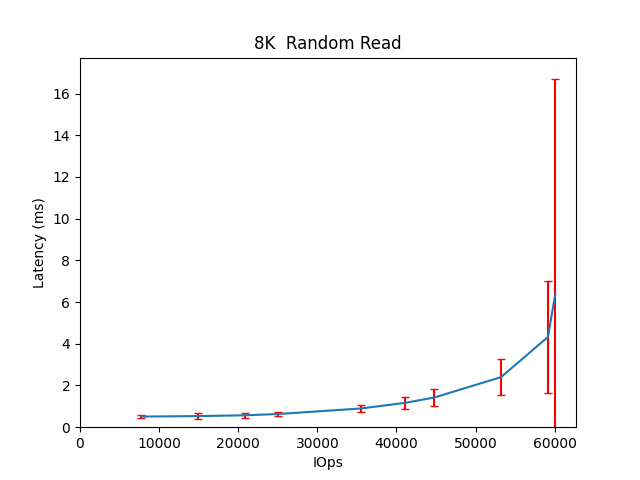

Performance Report for cbt_15thDec_alexls11_4k
==============================================

Contents
========

* [Performance Report](#performance-report)
	* [Summary of results](#summary-of-results)
	* [Response Curves](#response-curves)

# Performance Report

## Summary of results

|Workload Name|Maximum Throughput|Latency (ms)|
| :--- | :--- | :--- |
|65536B_randwrite|188.7299 MB/s|44.4379|
|524288B_randwrite|470.7366 MB/s|71.1375|
|16384B_randwrite|4934.8239 IOps|25.9165|
|1048576B_randwrite|507.7503 MB/s|32.6958|
|262144B_randwrite|421.4703 MB/s|79.5865|
|32768B_randwrite|4527.9963 IOps|28.2409|
|8192B_randwrite|5633.7559 IOps|22.7070|
|4096B_randwrite|5422.7843 IOps|23.5896|
|4096B_read|24623.0879 IOps|7.7937|
|524288B_read|1508.5785 MB/s|11.1161|
|8192B_read|16615.5410 IOps|11.5516|
|262144B_read|1482.0202 MB/s|11.3156|
|1048576B_read|1533.3567 MB/s|13.6712|
|16384B_read|10582.2102 IOps|18.1388|
|32768B_read|11252.6446 IOps|17.0558|
|65536B_read|973.9176 MB/s|17.2244|
|8192B_write|3623.6658 IOps|70.6395|
|16384B_write|4964.5973 IOps|38.6603|
|32768B_write|4198.4506 IOps|30.4715|
|262144B_write|527.7350 MB/s|3.9273|
|65536B_write|185.9803 MB/s|45.1059|
|524288B_write|452.3074 MB/s|27.6592|
|1048576B_write|483.6625 MB/s|25.7017|
|4096B_write|3636.8375 IOps|70.4108|
|524288B_randread|1697.4216 MB/s|19.7684|
|65536B_randread|1626.5640 MB/s|10.3129|
|262144B_randread|1703.3836 MB/s|19.7043|
|8192B_randread|60075.1583 IOps|6.3871|
|4096B_randread|96008.6828 IOps|3.9964|
|16384B_randread|34968.3595 IOps|7.3135|
|32768B_randread|30558.8191 IOps|8.3717|
|1048576B_randread|1712.1477 MB/s|19.5969|
|16384B_70_30_randrw|8081.7449 IOps|15.8261|
|65536B_70_30_randrw|331.6720 MB/s|25.2851|
|65536B_30_70_randrw|221.2702 MB/s|37.9076|

## Response Curves

|||
| :---: | :---: |
|||
|||
|||
|||
|||
|||
|||
|||
|||
|||
|||
|||
|||
|||
|||
|||
|||
|||
