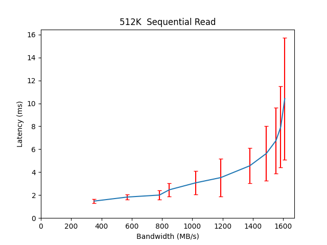
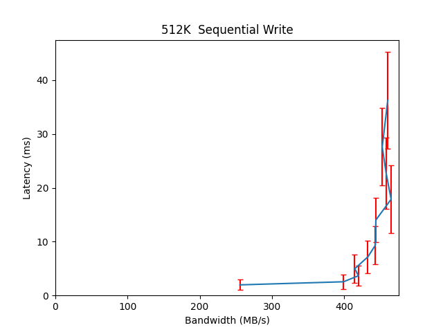

Performance Report for cbt_16thDec_alexls10_64k
===============================================

Contents
========

* [Performance Report](#performance-report)
	* [Summary of results](#summary-of-results)
	* [Response Curves](#response-curves)

# Performance Report

## Summary of results

|Workload Name|Maximum Throughput|Latency (ms)|
| :--- | :--- | :--- |
|4096B_read|24865.8579 IOps|7.7178|
|16384B_read|24594.4910 IOps|7.8029|
|65536B_read|1563.7256 MB/s|10.7260|
|524288B_read|1610.3699 MB/s|10.4135|
|1048576B_read|1616.4156 MB/s|12.9688|
|32768B_read|26069.6551 IOps|7.3607|
|8192B_read|22705.3423 IOps|8.4526|
|262144B_read|1545.4750 MB/s|10.8512|
|8192B_write|4935.2405 IOps|51.8468|
|524288B_write|465.2251 MB/s|17.8906|
|1048576B_write|466.8979 MB/s|22.1578|
|32768B_write|2666.4058 IOps|47.9892|
|4096B_write|4370.7817 IOps|58.5301|
|16384B_write|4531.9528 IOps|42.3309|
|65536B_write|135.2593 MB/s|62.0165|
|262144B_write|441.0831 MB/s|28.4446|
|32768B_randread|53341.7992 IOps|4.7947|
|8192B_randread|86144.2071 IOps|4.4541|
|524288B_randread|1746.7269 MB/s|19.2103|
|4096B_randread|94180.3410 IOps|4.0738|
|65536B_randread|1801.2506 MB/s|9.3130|
|262144B_randread|1742.8108 MB/s|19.2607|
|16384B_randread|78269.8275 IOps|4.9027|
|1048576B_randread|1738.2098 MB/s|19.3016|
|8192B_randwrite|4982.8270 IOps|25.6693|
|524288B_randwrite|478.4696 MB/s|43.6567|
|4096B_randwrite|6319.4208 IOps|20.2426|
|65536B_randwrite|116.7106 MB/s|71.9388|
|262144B_randwrite|464.5345 MB/s|72.1470|
|1048576B_randwrite|466.9014 MB/s|71.6185|
|32768B_randwrite|2989.8071 IOps|42.8219|
|16384B_randwrite|4194.2196 IOps|30.4957|
|16384B_70_30_randrw|11548.0566 IOps|11.0741|
|65536B_70_30_randrw|321.0689 MB/s|26.1256|
|65536B_30_70_randrw|157.0522 MB/s|53.4320|

## Response Curves

|||
| :---: | :---: |
|||
|||
|||
|||
|||
|||
|||
|||
|||
|||
|||
|||
|||
|||
|||
|||
|||
|||
