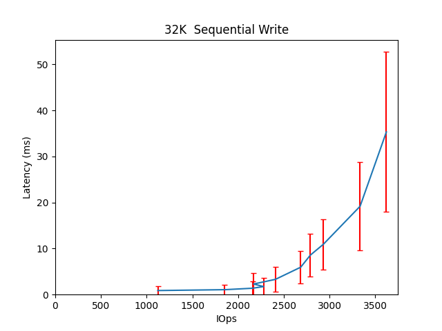
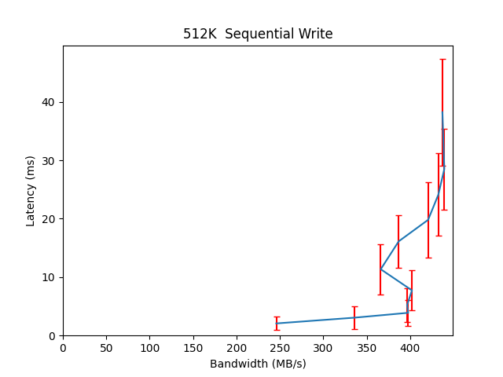

Performance Report for cbt_17thDec_main_4k
==========================================

Contents
========

* [Performance Report](#performance-report)
	* [Summary of results](#summary-of-results)
	* [Response Curves](#response-curves)

# Performance Report

## Summary of results

|Workload Name|Maximum Throughput|Latency (ms)|
| :--- | :--- | :--- |
|262144B_write|400.4765 MB/s|31.3389|
|65536B_write|196.1180 MB/s|42.7669|
|32768B_write|3620.5874 IOps|35.3283|
|16384B_write|5117.4727 IOps|37.4952|
|4096B_write|2024.1738 IOps|126.3761|
|524288B_write|439.2964 MB/s|28.4842|
|1048576B_write|472.4820 MB/s|26.3239|
|8192B_write|2018.9473 IOps|126.6406|
|262144B_read|1494.5327 MB/s|11.2209|
|8192B_read|17196.4646 IOps|11.1611|
|16384B_read|10428.1859 IOps|18.4055|
|1048576B_read|1532.8029 MB/s|13.6766|
|524288B_read|1500.9012 MB/s|11.1725|
|32768B_read|11408.5638 IOps|16.8221|
|65536B_read|976.7843 MB/s|17.1740|
|4096B_read|25339.3991 IOps|7.5736|
|4096B_randwrite|2897.0926 IOps|44.1754|
|16384B_randwrite|5725.9806 IOps|22.3408|
|32768B_randwrite|3245.3431 IOps|39.4089|
|65536B_randwrite|193.3909 MB/s|21.6591|
|262144B_randwrite|334.7603 MB/s|100.1591|
|8192B_randwrite|2791.1892 IOps|45.8625|
|524288B_randwrite|463.9652 MB/s|72.1673|
|1048576B_randwrite|472.2383 MB/s|35.1724|
|4096B_randread|95500.6999 IOps|4.0179|
|16384B_randread|34617.7534 IOps|11.0927|
|32768B_randread|31325.8783 IOps|4.0792|
|8192B_randread|60546.2847 IOps|6.3369|
|1048576B_randread|1709.0487 MB/s|19.6297|
|65536B_randread|1642.1913 MB/s|10.2136|
|262144B_randread|1680.3918 MB/s|19.9732|
|524288B_randread|1697.7714 MB/s|19.7620|
|16384B_70_30_randrw|6190.9364 IOps|20.6634|
|65536B_70_30_randrw|287.7383 MB/s|29.1583|
|65536B_30_70_randrw|165.9484 MB/s|12.6166|

## Response Curves

|||
| :---: | :---: |
|||
|||
|||
|||
|||
|||
|||
|||
|||
|||
|||
|||
|||
|||
|||
|||
|||
|||
