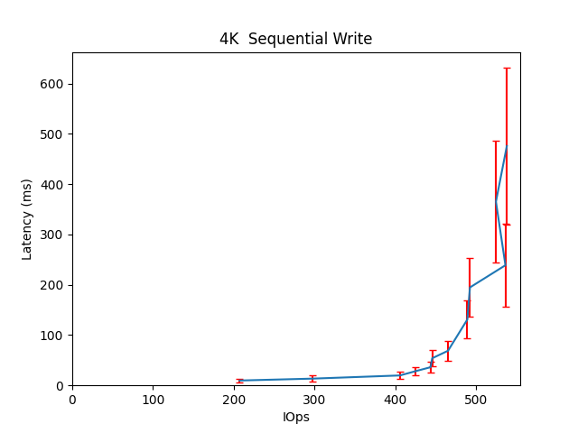
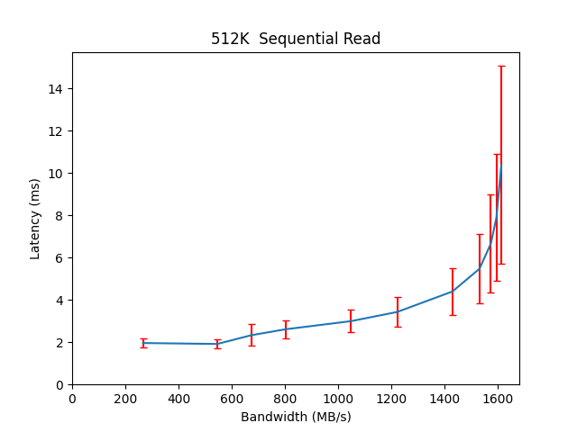

Performance Report for cbt_19thDec_main_256k
============================================

Contents
========

* [Performance Report](#performance-report)
	* [Summary of results](#summary-of-results)
	* [Response Curves](#response-curves)

# Performance Report

## Summary of results

|Workload Name|Maximum Throughput|Latency (ms)|
| :--- | :--- | :--- |
|65536B_randwrite|23.0993 MB/s|68.1146|
|262144B_randwrite|89.8802 MB/s|46.5725|
|16384B_randwrite|336.4694 IOps|379.8921|
|524288B_randwrite|185.2697 MB/s|90.4403|
|8192B_randwrite|331.4162 IOps|385.7299|
|32768B_randwrite|351.7060 IOps|362.8099|
|1048576B_randwrite|550.5941 MB/s|52.9692|
|4096B_randwrite|348.8221 IOps|22.9168|
|262144B_randread|1780.7814 MB/s|18.8481|
|32768B_randread|6840.6470 IOps|37.4864|
|65536B_randread|442.0152 MB/s|38.0066|
|1048576B_randread|1752.7290 MB/s|11.9599|
|8192B_randread|6879.8561 IOps|18.6039|
|524288B_randread|1772.9247 MB/s|18.9249|
|16384B_randread|6849.0893 IOps|9.3397|
|4096B_randread|6580.5715 IOps|9.7208|
|8192B_write|567.0153 IOps|449.1068|
|65536B_write|32.3171 MB/s|260.4982|
|4096B_write|537.7805 IOps|475.7264|
|16384B_write|521.6193 IOps|367.2508|
|1048576B_write|540.5912 MB/s|15.2250|
|524288B_write|210.9673 MB/s|49.5728|
|32768B_write|475.6427 IOps|268.6917|
|262144B_write|112.4266 MB/s|74.5978|
|65536B_read|1552.4492 MB/s|10.8044|
|262144B_read|1618.4592 MB/s|10.3627|
|8192B_read|21907.1426 IOps|8.7607|
|16384B_read|25012.2488 IOps|7.6722|
|524288B_read|1614.2671 MB/s|10.3888|
|4096B_read|20139.3648 IOps|9.5304|
|1048576B_read|1617.9198 MB/s|12.9568|
|32768B_read|26204.9158 IOps|7.3229|
|16384B_70_30_randrw|1118.8527 IOps|114.6396|
|65536B_70_30_randrw|80.4179 MB/s|104.3508|
|65536B_30_70_randrw|32.6806 MB/s|16.0181|

## Response Curves

|||
| :---: | :---: |
|||
|||
|||
|||
|||
|||
|||
|||
|||
|||
|||
|||
|||
|||
|||
|||
|||
|||
