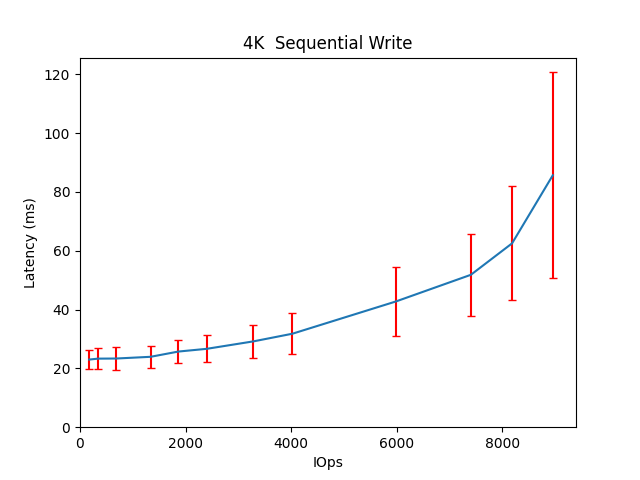
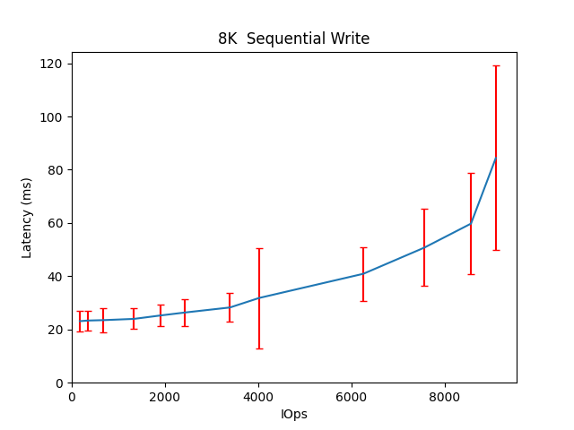
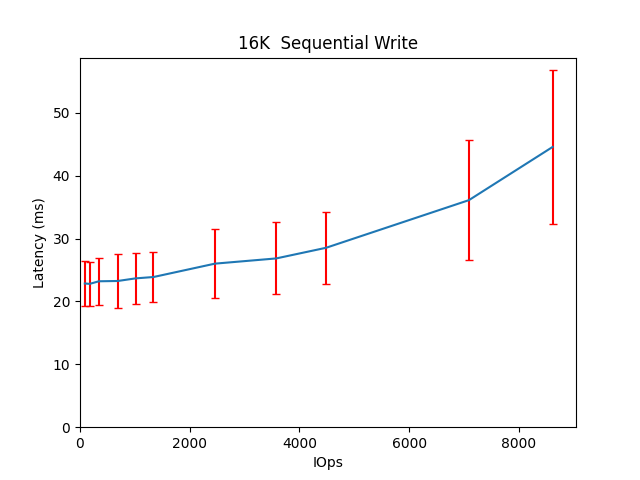
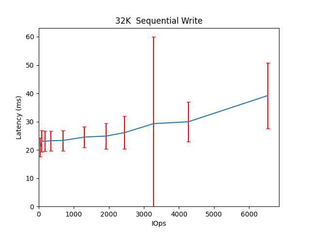
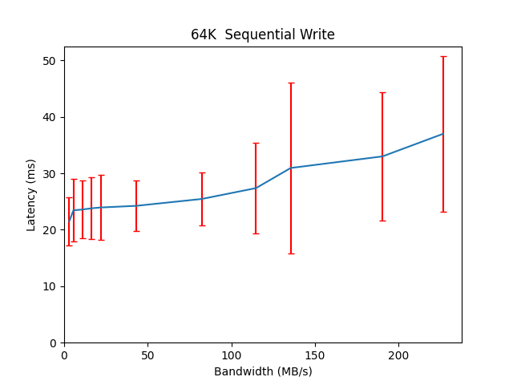
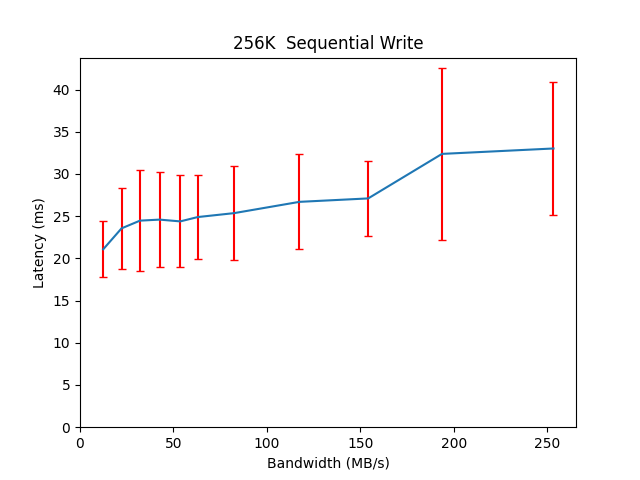
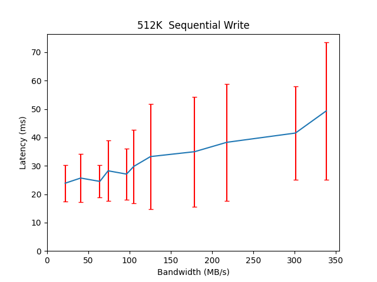
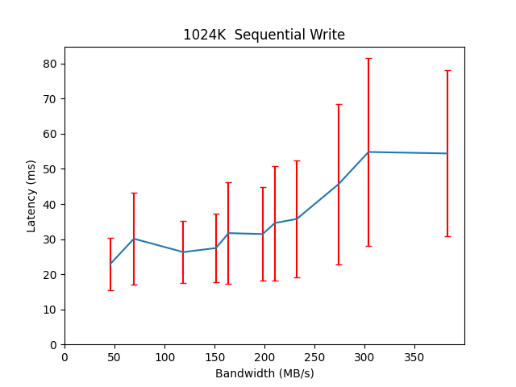

Performance Report for cbt-20thFeb-main-8vol-finegrain-cacheon-rbdoff-allappends
================================================================================

Table of contents
=================

* [Summary of results for cbt-20thFeb-main-8vol-finegrain-cacheon-rbdoff-allappends](#summary-of-results-for-cbt-20thfeb-main-8vol-finegrain-cacheon-rbdoff-allappends)
* [Response Curves](#response-curves)
	* [Sequential Write](#sequential-write)
* [Configuration yaml](#configuration-yaml)

# Summary of results for cbt-20thFeb-main-8vol-finegrain-cacheon-rbdoff-allappends
  
|Workload Name|Maximum Throughput|Latency (ms)|  
| :--- | ---: | ---: |  
|[4096B_write](#4096B-write)|8959 IOps|85.7|  
|[8192B_write](#8192B-write)|9096 IOps|84.4|  
|[16384B_write](#16384B-write)|8613 IOps|44.6|  
|[32768B_write](#32768B-write)|6530 IOps|39.2|  
|[65536B_write](#65536B-write)|227 MB/s|37.0|  
|[262144B_write](#262144B-write)|253 MB/s|33.0|  
|[524288B_write](#524288B-write)|339 MB/s|49.3|  
|[1048576B_write](#1048576B-write)|383 MB/s|54.4|
# Response Curves

## Sequential Write

|||
| :---: | :---: |
|<a name="4096B-write"></a>|<a name="8192B-write"></a>|
|<a name="16384B-write"></a>|<a name="32768B-write"></a>|
|<a name="65536B-write"></a>|<a name="262144B-write"></a>|
|<a name="524288B-write"></a>|<a name="1048576B-write"></a>|

# Configuration yaml


```benchmarks:
  librbdfio:
    cmd_path: /usr/local/bin/fio
    fio_out_format: json
    log_avg_msec: 100
    log_bw: true
    log_iops: true
    log_lat: true
    norandommap: true
    osd_ra:
    - 4096
    poolname: rbd_replicated
    prefill:
      blocksize: 64k
      numjobs: 1
    procs_per_volume:
    - 1
    ramp: 30
    time: 90
    time_based: true
    use_existing_volumes: true
    vol_size: 1000
    volumes_per_client:
    - 8
    workloads:
      64kseqwriteappend:
        jobname: write
        mode: write
        numjobs:
        - 1
        op_size: 65536
        pre_workload_script: /cbt.lee/tools/setup_cluster/mkdelvols.cbt
        total_iodepth:
        - 1
        - 2
        - 4
        - 6
        - 8
        - 16
        - 32
        - 48
        - 64
        - 96
        - 128
      seq16kwriteappend:
        jobname: seqwrite
        mode: write
        numjobs:
        - 1
        op_size: 16384
        pre_workload_script: /cbt.lee/tools/setup_cluster/mkdelvols.cbt
        total_iodepth:
        - 2
        - 4
        - 8
        - 16
        - 24
        - 32
        - 64
        - 96
        - 128
        - 256
        - 384
      seq1Mwriteappend:
        jobname: seqwrite
        mode: write
        numjobs:
        - 1
        op_size: 1048576
        pre_workload_script: /cbt.lee/tools/setup_cluster/mkdelvols.cbt
        total_iodepth:
        - 1
        - 2
        - 3
        - 4
        - 5
        - 6
        - 7
        - 8
        - 12
        - 16
        - 20
      seq256kwriteappend:
        jobname: seqwrite
        mode: write
        numjobs:
        - 1
        op_size: 262144
        pre_workload_script: /cbt.lee/tools/setup_cluster/mkdelvols.cbt
        total_iodepth:
        - 1
        - 2
        - 3
        - 4
        - 5
        - 6
        - 8
        - 12
        - 16
        - 24
        - 32
      seq32kwriteappend:
        jobname: seqwrite
        mode: write
        numjobs:
        - 1
        op_size: 32768
        pre_workload_script: /cbt.lee/tools/setup_cluster/mkdelvols.cbt
        total_iodepth:
        - 1
        - 2
        - 4
        - 8
        - 16
        - 32
        - 48
        - 64
        - 96
        - 128
        - 256
      seq4kwriteappend:
        jobname: seqwrite
        mode: write
        numjobs:
        - 1
        op_size: 4096
        pre_workload_script: /cbt.lee/tools/setup_cluster/mkdelvols.cbt
        total_iodepth:
        - 4
        - 8
        - 16
        - 32
        - 48
        - 64
        - 96
        - 128
        - 256
        - 384
        - 512
        - 768
      seq512kwriteappend:
        jobname: seqwrite
        mode: write
        numjobs:
        - 1
        op_size: 524288
        pre_workload_script: /cbt.lee/tools/setup_cluster/mkdelvols.cbt
        total_iodepth:
        - 1
        - 2
        - 3
        - 4
        - 5
        - 6
        - 8
        - 12
        - 16
        - 24
        - 32
      seq8kwriteappend:
        jobname: seqwrite
        mode: write
        numjobs:
        - 1
        op_size: 8192
        pre_workload_script: /cbt.lee/tools/setup_cluster/mkdelvols.cbt
        total_iodepth:
        - 4
        - 8
        - 16
        - 32
        - 48
        - 64
        - 96
        - 128
        - 256
        - 384
        - 512
        - 768
cluster:
  archive_dir: /tmp/cbt
  ceph-mgr_cmd: /usr/bin/ceph-mgr
  ceph-mon_cmd: /usr/bin/ceph-mon
  ceph-osd_cmd: /usr/bin/ceph-osd
  ceph-run_cmd: /usr/bin/ceph-run
  ceph_cmd: /usr/bin/ceph
  clients:
  - --- server1 ---
  clusterid: ceph
  conf_file: /cbt/ceph.conf.4x1x1.fs
  fs: xfs
  head: --- server1 ---
  iterations: 1
  mgrs:
    --- server1 ---:
      a: null
  mkfs_opts: -f -i size=2048
  mons:
    --- server1 ---:
      a: --- IP Address --:6789
  mount_opts: -o inode64,noatime,logbsize=256k
  osds:
  - --- server1 ---
  osds_per_node: 6
  pdsh_ssh_args: -a -x -l%u %h
  rados_cmd: /usr/bin/rados
  rbd_cmd: /usr/bin/rbd
  tmp_dir: /tmp/cbt
  use_existing: true
  user: root
monitoring_profiles:
  collectl:
    args: -c 18 -sCD -i 10 -P -oz -F0 --rawtoo --sep ";" -f {collectl_dir}
```