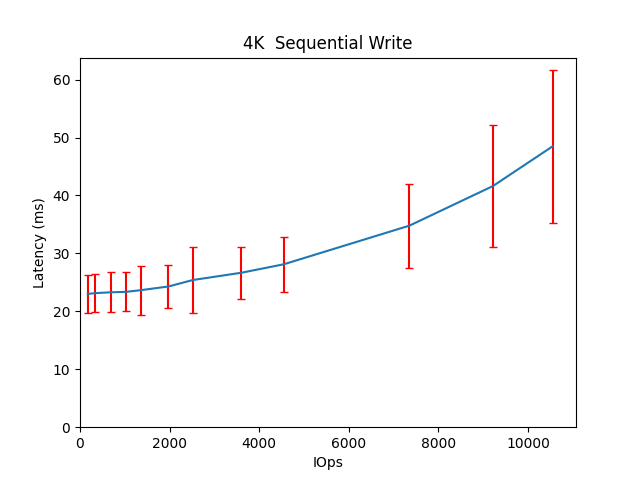
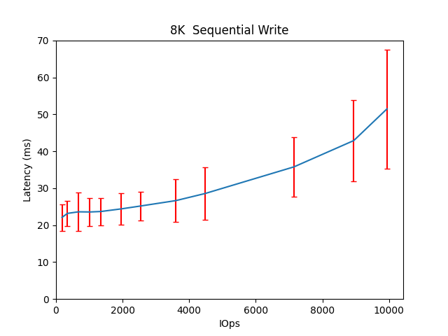

Performance Report for cbt-19thFeb-ecoptmain-8vol-finegrain-cacheon-rbdoff-appends
==================================================================================

Table of contents
=================

* [Summary of results for cbt-19thFeb-ecoptmain-8vol-finegrain-cacheon-rbdoff-appends](#summary-of-results-for-cbt-19thfeb-ecoptmain-8vol-finegrain-cacheon-rbdoff-appends)
* [Response Curves](#response-curves)
	* [Sequential Write](#sequential-write)
* [Configuration yaml](#configuration-yaml)

# Summary of results for cbt-19thFeb-ecoptmain-8vol-finegrain-cacheon-rbdoff-appends
  
|Workload Name|Maximum Throughput|Latency (ms)|  
| :--- | ---: | ---: |  
|[4096B_write](#4096B-write)|10553 IOps|48.5|  
|[8192B_write](#8192B-write)|9939 IOps|51.5|
# Response Curves

## Sequential Write

|||
| :---: | :---: |
|<a name="4096B-write"></a>|<a name="8192B-write"></a>|

# Configuration yaml


```benchmarks:
  librbdfio:
    cmd_path: /usr/local/bin/fio
    fio_out_format: json
    log_avg_msec: 100
    log_bw: true
    log_iops: true
    log_lat: true
    norandommap: true
    osd_ra:
    - 4096
    poolname: rbd_replicated
    prefill:
      blocksize: 64k
      numjobs: 1
    procs_per_volume:
    - 1
    ramp: 30
    time: 60
    time_based: true
    use_existing_volumes: true
    vol_size: 1000
    volumes_per_client:
    - 8
    workloads:
      seq4kwriteappend:
        jobname: seqwrite
        mode: write
        numjobs:
        - 1
        op_size: 4096
        pre_workload_script: /cbt.lee/tools/setup_cluster/mkdelvols.cbt
        total_iodepth:
        - 4
        - 8
        - 16
        - 24
        - 32
        - 48
        - 64
        - 96
        - 128
        - 256
        - 384
        - 512
      seq8kwriteappend:
        jobname: seqwrite
        mode: write
        numjobs:
        - 1
        op_size: 8192
        pre_workload_script: /cbt.lee/tools/setup_cluster/mkdelvols.cbt
        total_iodepth:
        - 4
        - 8
        - 16
        - 24
        - 32
        - 48
        - 64
        - 96
        - 128
        - 256
        - 384
        - 512
cluster:
  archive_dir: /tmp/cbt
  ceph-mgr_cmd: /usr/bin/ceph-mgr
  ceph-mon_cmd: /usr/bin/ceph-mon
  ceph-osd_cmd: /usr/bin/ceph-osd
  ceph-run_cmd: /usr/bin/ceph-run
  ceph_cmd: /usr/bin/ceph
  clients:
  - --- server1 ---
  clusterid: ceph
  conf_file: /cbt/ceph.conf.4x1x1.fs
  fs: xfs
  head: --- server1 ---
  iterations: 1
  mgrs:
    --- server1 ---:
      a: null
  mkfs_opts: -f -i size=2048
  mons:
    --- server1 ---:
      a: --- IP Address --:6789
  mount_opts: -o inode64,noatime,logbsize=256k
  osds:
  - --- server1 ---
  osds_per_node: 6
  pdsh_ssh_args: -a -x -l%u %h
  rados_cmd: /usr/bin/rados
  rbd_cmd: /usr/bin/rbd
  tmp_dir: /tmp/cbt
  use_existing: true
  user: root
monitoring_profiles:
  collectl:
    args: -c 18 -sCD -i 10 -P -oz -F0 --rawtoo --sep ";" -f {collectl_dir}
```