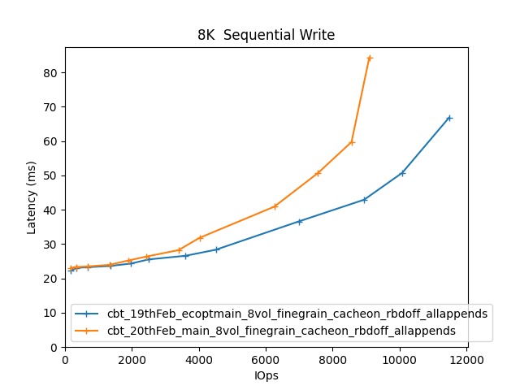

Comparitive Performance Report for cbt-19thFeb-ecoptmain-8vol-finegrain-cacheon-rbdoff-allappends vs cbt-20thFeb-main-8vol-finegrain-cacheon-rbdoff-allappends
==============================================================================================================================================================

Table of contents
=================

* [Comparison summary for cbt-19thFeb-ecoptmain-8vol-finegrain-cacheon-rbdoff-allappends vs cbt-20thFeb-main-8vol-finegrain-cacheon-rbdoff-allappends](#comparison-summary-for-cbt-19thfeb-ecoptmain-8vol-finegrain-cacheon-rbdoff-allappends-vs-cbt-20thfeb-main-8vol-finegrain-cacheon-rbdoff-allappends)
* [Response Curves](#response-curves)
	* [Sequential Write](#sequential-write)
* [Configuration yaml files](#configuration-yaml-files)
	* [results](#results)

# Comparison summary for cbt-19thFeb-ecoptmain-8vol-finegrain-cacheon-rbdoff-allappends vs cbt-20thFeb-main-8vol-finegrain-cacheon-rbdoff-allappends
  
  
|Sequential Write|cbt_19thFeb_ecoptmain_8vol_finegrain_cacheon_rbdoff_allappends|cbt_20thFeb_main_8vol_finegrain_cacheon_rbdoff_allappends|%change throughput|%change latency|  
| :--- | ---: | ---: | ---: | ---: |  
|[4K](#4096B-write)|11900 IOps@64.5ms|8959 IOps@85.7ms|-25%|33%|  
|[8K](#8192B-write)|11480 IOps@66.9ms|9096 IOps@84.4ms|-21%|26%|  
|[16K](#16384B-write)|8996 IOps@42.7ms|8613 IOps@44.6ms|-4%|4%|  
|[32K](#32768B-write)|6670 IOps@38.4ms|6530 IOps@39.2ms|-2%|2%|  
|[64K](#65536B-write)|219 MB/s@38.4ms|227 MB/s@37.0ms|4%|-4%|  
|[256K](#262144B-write)|249 MB/s@33.6ms|253 MB/s@33.0ms|2%|-2%|  
|[512K](#524288B-write)|299 MB/s@55.9ms|339 MB/s@49.3ms|13%|-12%|  
|[1024K](#1048576B-write)|372 MB/s@55.9ms|383 MB/s@54.4ms|3%|-3%|  
  
  
  
  

# Response Curves

## Sequential Write

|||
| :---: | :---: |
|<a name="4096B-write"></a>|<a name="8192B-write"></a>|
|<a name="16384B-write"></a>|<a name="32768B-write"></a>|
|<a name="65536B-write"></a>|<a name="262144B-write"></a>|
|<a name="524288B-write"></a>|<a name="1048576B-write"></a>|

# Configuration yaml files


Only yaml files that differ by more than 20 lines from the yaml file for the baseline directory will be added here in addition to the baseline yaml  

## results


```benchmarks:
  librbdfio:
    cmd_path: /usr/local/bin/fio
    fio_out_format: json
    log_avg_msec: 100
    log_bw: true
    log_iops: true
    log_lat: true
    norandommap: true
    osd_ra:
    - 4096
    poolname: rbd_replicated
    prefill:
      blocksize: 64k
      numjobs: 1
    procs_per_volume:
    - 1
    ramp: 30
    time: 90
    time_based: true
    use_existing_volumes: true
    vol_size: 1000
    volumes_per_client:
    - 8
    workloads:
      64kseqwriteappend:
        jobname: write
        mode: write
        numjobs:
        - 1
        op_size: 65536
        pre_workload_script: /cbt.lee/tools/setup_cluster/mkdelvols.cbt
        total_iodepth:
        - 1
        - 2
        - 4
        - 6
        - 8
        - 16
        - 32
        - 48
        - 64
        - 96
        - 128
      seq16kwriteappend:
        jobname: seqwrite
        mode: write
        numjobs:
        - 1
        op_size: 16384
        pre_workload_script: /cbt.lee/tools/setup_cluster/mkdelvols.cbt
        total_iodepth:
        - 2
        - 4
        - 8
        - 16
        - 24
        - 32
        - 64
        - 96
        - 128
        - 256
        - 384
      seq1Mwriteappend:
        jobname: seqwrite
        mode: write
        numjobs:
        - 1
        op_size: 1048576
        pre_workload_script: /cbt.lee/tools/setup_cluster/mkdelvols.cbt
        total_iodepth:
        - 1
        - 2
        - 3
        - 4
        - 5
        - 6
        - 7
        - 8
        - 12
        - 16
        - 20
      seq256kwriteappend:
        jobname: seqwrite
        mode: write
        numjobs:
        - 1
        op_size: 262144
        pre_workload_script: /cbt.lee/tools/setup_cluster/mkdelvols.cbt
        total_iodepth:
        - 1
        - 2
        - 3
        - 4
        - 5
        - 6
        - 8
        - 12
        - 16
        - 24
        - 32
      seq32kwriteappend:
        jobname: seqwrite
        mode: write
        numjobs:
        - 1
        op_size: 32768
        pre_workload_script: /cbt.lee/tools/setup_cluster/mkdelvols.cbt
        total_iodepth:
        - 1
        - 2
        - 4
        - 8
        - 16
        - 32
        - 48
        - 64
        - 96
        - 128
        - 256
      seq4kwriteappend:
        jobname: seqwrite
        mode: write
        numjobs:
        - 1
        op_size: 4096
        pre_workload_script: /cbt.lee/tools/setup_cluster/mkdelvols.cbt
        total_iodepth:
        - 4
        - 8
        - 16
        - 32
        - 48
        - 64
        - 96
        - 128
        - 256
        - 384
        - 512
        - 768
      seq512kwriteappend:
        jobname: seqwrite
        mode: write
        numjobs:
        - 1
        op_size: 524288
        pre_workload_script: /cbt.lee/tools/setup_cluster/mkdelvols.cbt
        total_iodepth:
        - 1
        - 2
        - 3
        - 4
        - 5
        - 6
        - 8
        - 12
        - 16
        - 24
        - 32
      seq8kwriteappend:
        jobname: seqwrite
        mode: write
        numjobs:
        - 1
        op_size: 8192
        pre_workload_script: /cbt.lee/tools/setup_cluster/mkdelvols.cbt
        total_iodepth:
        - 4
        - 8
        - 16
        - 32
        - 48
        - 64
        - 96
        - 128
        - 256
        - 384
        - 512
        - 768
cluster:
  archive_dir: /tmp/cbt
  ceph-mgr_cmd: /usr/bin/ceph-mgr
  ceph-mon_cmd: /usr/bin/ceph-mon
  ceph-osd_cmd: /usr/bin/ceph-osd
  ceph-run_cmd: /usr/bin/ceph-run
  ceph_cmd: /usr/bin/ceph
  clients:
  - --- server1 ---
  clusterid: ceph
  conf_file: /cbt/ceph.conf.4x1x1.fs
  fs: xfs
  head: --- server1 ---
  iterations: 1
  mgrs:
    --- server1 ---:
      a: null
  mkfs_opts: -f -i size=2048
  mons:
    --- server1 ---:
      a: --- IP Address --:6789
  mount_opts: -o inode64,noatime,logbsize=256k
  osds:
  - --- server1 ---
  osds_per_node: 6
  pdsh_ssh_args: -a -x -l%u %h
  rados_cmd: /usr/bin/rados
  rbd_cmd: /usr/bin/rbd
  tmp_dir: /tmp/cbt
  use_existing: true
  user: root
monitoring_profiles:
  collectl:
    args: -c 18 -sCD -i 10 -P -oz -F0 --rawtoo --sep ";" -f {collectl_dir}
```

```benchmarks:
  librbdfio:
    cmd_path: /usr/local/bin/fio
    fio_out_format: json
    log_avg_msec: 100
    log_bw: true
    log_iops: true
    log_lat: true
    norandommap: true
    osd_ra:
    - 4096
    poolname: rbd_replicated
    prefill:
      blocksize: 64k
      numjobs: 1
    procs_per_volume:
    - 1
    ramp: 30
    time: 90
    time_based: true
    use_existing_volumes: true
    vol_size: 1000
    volumes_per_client:
    - 8
    workloads:
      64kseqwriteappend:
        jobname: write
        mode: write
        numjobs:
        - 1
        op_size: 65536
        pre_workload_script: /cbt.lee/tools/setup_cluster/mkdelvols.cbt
        total_iodepth:
        - 1
        - 2
        - 4
        - 6
        - 8
        - 16
        - 32
        - 48
        - 64
        - 96
        - 128
      seq16kwriteappend:
        jobname: seqwrite
        mode: write
        numjobs:
        - 1
        op_size: 16384
        pre_workload_script: /cbt.lee/tools/setup_cluster/mkdelvols.cbt
        total_iodepth:
        - 2
        - 4
        - 8
        - 16
        - 24
        - 32
        - 64
        - 96
        - 128
        - 256
        - 384
      seq1Mwriteappend:
        jobname: seqwrite
        mode: write
        numjobs:
        - 1
        op_size: 1048576
        pre_workload_script: /cbt.lee/tools/setup_cluster/mkdelvols.cbt
        total_iodepth:
        - 1
        - 2
        - 3
        - 4
        - 5
        - 6
        - 7
        - 8
        - 12
        - 16
        - 20
      seq256kwriteappend:
        jobname: seqwrite
        mode: write
        numjobs:
        - 1
        op_size: 262144
        pre_workload_script: /cbt.lee/tools/setup_cluster/mkdelvols.cbt
        total_iodepth:
        - 1
        - 2
        - 3
        - 4
        - 5
        - 6
        - 8
        - 12
        - 16
        - 24
        - 32
      seq32kwriteappend:
        jobname: seqwrite
        mode: write
        numjobs:
        - 1
        op_size: 32768
        pre_workload_script: /cbt.lee/tools/setup_cluster/mkdelvols.cbt
        total_iodepth:
        - 1
        - 2
        - 4
        - 8
        - 16
        - 32
        - 48
        - 64
        - 96
        - 128
        - 256
      seq4kwriteappend:
        jobname: seqwrite
        mode: write
        numjobs:
        - 1
        op_size: 4096
        pre_workload_script: /cbt.lee/tools/setup_cluster/mkdelvols.cbt
        total_iodepth:
        - 4
        - 8
        - 16
        - 32
        - 48
        - 64
        - 96
        - 128
        - 256
        - 384
        - 512
        - 768
      seq512kwriteappend:
        jobname: seqwrite
        mode: write
        numjobs:
        - 1
        op_size: 524288
        pre_workload_script: /cbt.lee/tools/setup_cluster/mkdelvols.cbt
        total_iodepth:
        - 1
        - 2
        - 3
        - 4
        - 5
        - 6
        - 8
        - 12
        - 16
        - 24
        - 32
      seq8kwriteappend:
        jobname: seqwrite
        mode: write
        numjobs:
        - 1
        op_size: 8192
        pre_workload_script: /cbt.lee/tools/setup_cluster/mkdelvols.cbt
        total_iodepth:
        - 4
        - 8
        - 16
        - 32
        - 48
        - 64
        - 96
        - 128
        - 256
        - 384
        - 512
        - 768
cluster:
  archive_dir: /tmp/cbt
  ceph-mgr_cmd: /usr/bin/ceph-mgr
  ceph-mon_cmd: /usr/bin/ceph-mon
  ceph-osd_cmd: /usr/bin/ceph-osd
  ceph-run_cmd: /usr/bin/ceph-run
  ceph_cmd: /usr/bin/ceph
  clients:
  - --- server1 ---
  clusterid: ceph
  conf_file: /cbt/ceph.conf.4x1x1.fs
  fs: xfs
  head: --- server1 ---
  iterations: 1
  mgrs:
    --- server1 ---:
      a: null
  mkfs_opts: -f -i size=2048
  mons:
    --- server1 ---:
      a: --- IP Address --:6789
  mount_opts: -o inode64,noatime,logbsize=256k
  osds:
  - --- server1 ---
  osds_per_node: 6
  pdsh_ssh_args: -a -x -l%u %h
  rados_cmd: /usr/bin/rados
  rbd_cmd: /usr/bin/rbd
  tmp_dir: /tmp/cbt
  use_existing: true
  user: root
monitoring_profiles:
  collectl:
    args: -c 18 -sCD -i 10 -P -oz -F0 --rawtoo --sep ";" -f {collectl_dir}
```