Comparitive Performance Report for cbt-12thFeb-main-8vol-writesonly-finegrain vs cbt-13thFeb-alexls19-econ4k-8vol-writesonly-finegrain vs cbt-11thFeb-alexls20-econ4k-8vol-writesonly-finegrain vs cbt-11thFeb-alexls21-econ4k-8vol-writesonly-finegrain vs cbt-10thFeb-alexls22-econ4k-8vol-writesonly-finegrain
=================================================================================================================================================================================================================================================================================================================

Table of contents
=================

* [Comparison summary for cbt-12thFeb-main-8vol-writesonly-finegrain vs cbt-13thFeb-alexls19-econ4k-8vol-writesonly-finegrain vs cbt-11thFeb-alexls20-econ4k-8vol-writesonly-finegrain vs cbt-11thFeb-alexls21-econ4k-8vol-writesonly-finegrain vs cbt-10thFeb-alexls22-econ4k-8vol-writesonly-finegrain](#comparison-summary-for-cbt-12thfeb-main-8vol-writesonly-finegrain-vs-cbt-13thfeb-alexls19-econ4k-8vol-writesonly-finegrain-vs-cbt-11thfeb-alexls20-econ4k-8vol-writesonly-finegrain-vs-cbt-11thfeb-alexls21-econ4k-8vol-writesonly-finegrain-vs-cbt-10thfeb-alexls22-econ4k-8vol-writesonly-finegrain)
* [Response Curves](#response-curves)
	* [Sequential Write](#sequential-write)
	* [Random Write](#random-write)
	* [Random Read/Write](#random-readwrite)
* [Configuration yaml files](#configuration-yaml-files)
	* [results](#results)

# Comparison summary for cbt-12thFeb-main-8vol-writesonly-finegrain vs cbt-13thFeb-alexls19-econ4k-8vol-writesonly-finegrain vs cbt-11thFeb-alexls20-econ4k-8vol-writesonly-finegrain vs cbt-11thFeb-alexls21-econ4k-8vol-writesonly-finegrain vs cbt-10thFeb-alexls22-econ4k-8vol-writesonly-finegrain
  
  
|Sequential Write|cbt_12thFeb_main_8vol_writesonly_finegrain|cbt_13thFeb_alexls19_econ4k_8vol_writesonly_finegrain|%change|cbt_11thFeb_alexls20_econ4k_8vol_writesonly_finegrain|%change|cbt_11thFeb_alexls21_econ4k_8vol_writesonly_finegrain|%change|cbt_10thFeb_alexls22_econ4k_8vol_writesonly_finegrain|%change|  
| :--- | ---: | ---: | ---: | ---: | ---: | ---: | ---: | ---: | ---: |  
|[4K](#4096B-write)|3369@38.0ms|5783@44.3|72%|5861@43.7|74%|5888@43.5|75%|5548@46.1|65%|  
|[8K](#8192B-write)|2488@77.2ms|5263@48.6|112%|4928@51.9|98%|5062@50.6|103%|4977@51.4|100%|  
|[16K](#16384B-write)|5604@34.2ms|6452@29.7|15%|5953@32.2|6%|6095@31.5|9%|5906@32.5|5%|  
|[32K](#32768B-write)|9069@14.1ms|9069@14.1|0%|8047@7.9|-11%|8108@7.9|-11%|8071@7.9|-11%|  
|[64K](#65536B-write)|196@21.3ms|189@22.1|-4%|200@21.0|2%|194@21.6|-1%|205@20.5|5%|  
|[256K](#262144B-write)|302@1.7ms|360@2.9|19%|274@2.8|-9%|282@1.8|-7%|277@11.2|-8%|  
|[512K](#524288B-write)|447@11.5ms|439@14.1|-2%|439@14.1|-2%|436@14.2|-2%|438@14.1|-2%|  
  
  
|Random Write|cbt_12thFeb_main_8vol_writesonly_finegrain|cbt_13thFeb_alexls19_econ4k_8vol_writesonly_finegrain|%change|cbt_11thFeb_alexls20_econ4k_8vol_writesonly_finegrain|%change|cbt_11thFeb_alexls21_econ4k_8vol_writesonly_finegrain|%change|cbt_10thFeb_alexls22_econ4k_8vol_writesonly_finegrain|%change|  
| :--- | ---: | ---: | ---: | ---: | ---: | ---: | ---: | ---: | ---: |  
|[4K](#4096B-randwrite)|2239@57.1ms|4307@29.7|92%|4172@30.7|86%|4229@30.3|89%|4169@30.7|86%|  
|[8K](#8192B-randwrite)|2302@55.6ms|4412@29.0|92%|4824@26.5|110%|4490@28.5|95%|4560@28.1|98%|  
|[16K](#16384B-randwrite)|4094@31.2ms|4856@26.3|19%|4611@13.9|13%|4487@14.2|10%|4417@14.5|8%|  
|[32K](#32768B-randwrite)|3367@38.0ms|3330@38.4|-1%|3191@40.1|-5%|3068@20.8|-9%|3134@20.4|-7%|  
|[64K](#65536B-randwrite)|165@50.9ms|167@12.5|1%|168@12.4|2%|165@50.8|0%|166@25.2|1%|  
|[256K](#262144B-randwrite)|368@17.0ms|331@25.1|-10%|345@6.0|-6%|395@10.5|7%|333@6.2|-10%|  
|[512K](#524288B-randwrite)|444@47.0ms|439@37.9|-1%|442@47.1|-0%|445@46.9|0%|443@47.1|-0%|  
  
  
|Random Read/Write|cbt_12thFeb_main_8vol_writesonly_finegrain|cbt_13thFeb_alexls19_econ4k_8vol_writesonly_finegrain|%change|cbt_11thFeb_alexls20_econ4k_8vol_writesonly_finegrain|%change|cbt_11thFeb_alexls21_econ4k_8vol_writesonly_finegrain|%change|cbt_10thFeb_alexls22_econ4k_8vol_writesonly_finegrain|%change|  
| :--- | ---: | ---: | ---: | ---: | ---: | ---: | ---: | ---: | ---: |  
|[16K_70/30 ](#16384B-70-30-randrw)|6362@20.1ms|6100@21.0|-4%|5847@21.9|-8%|5882@21.7|-8%|5982@21.4|-6%|  

# Response Curves

## Sequential Write

|||
| :---: | :---: |
|<a name="4096B-write"></a>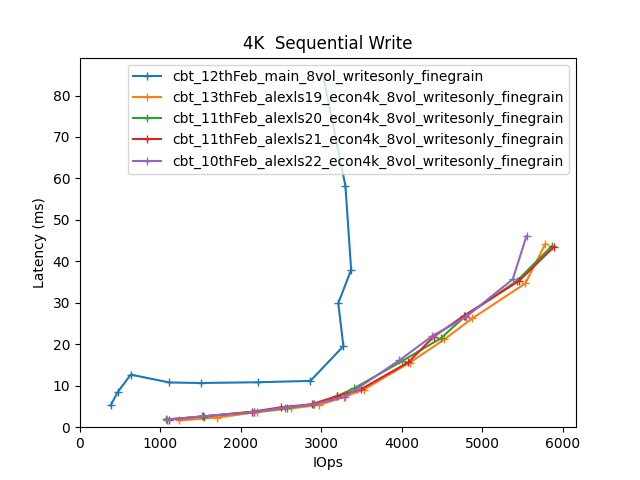|<a name="8192B-write"></a>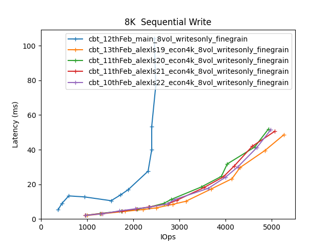|
|<a name="16384B-write"></a>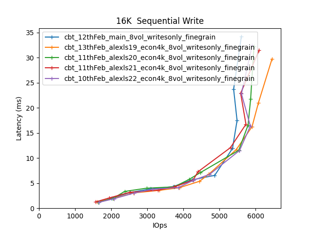|<a name="32768B-write"></a>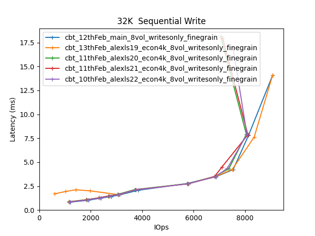|
|<a name="65536B-write"></a>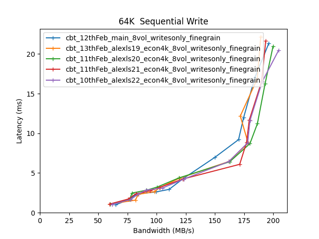|<a name="262144B-write"></a>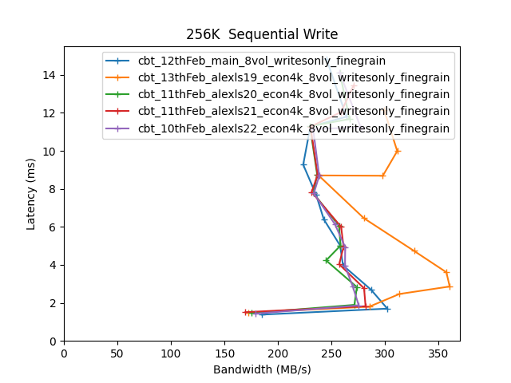|
|<a name="524288B-write"></a>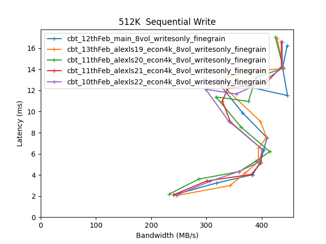||

## Random Write

|||
| :---: | :---: |
|<a name="4096B-randwrite"></a>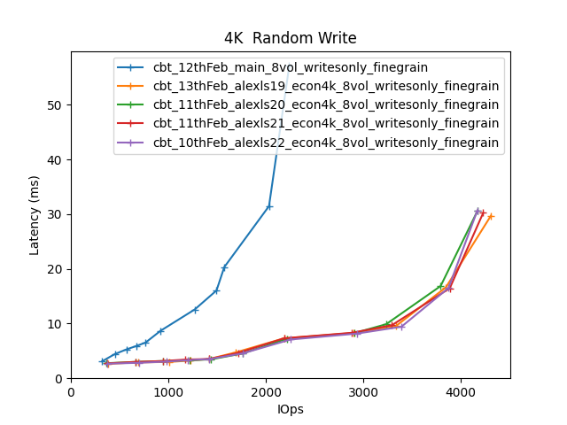|<a name="8192B-randwrite"></a>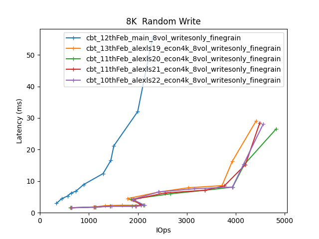|
|<a name="16384B-randwrite"></a>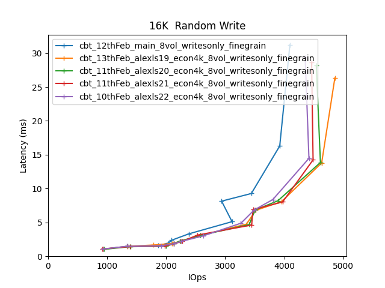|<a name="32768B-randwrite"></a>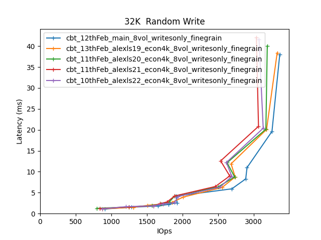|
|<a name="65536B-randwrite"></a>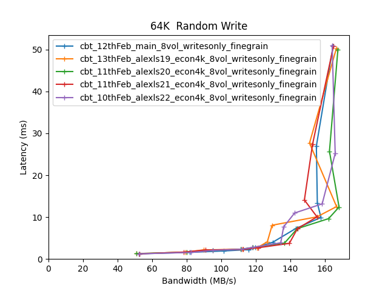|<a name="262144B-randwrite"></a>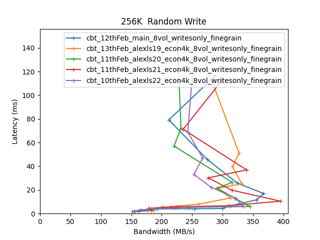|
|<a name="524288B-randwrite"></a>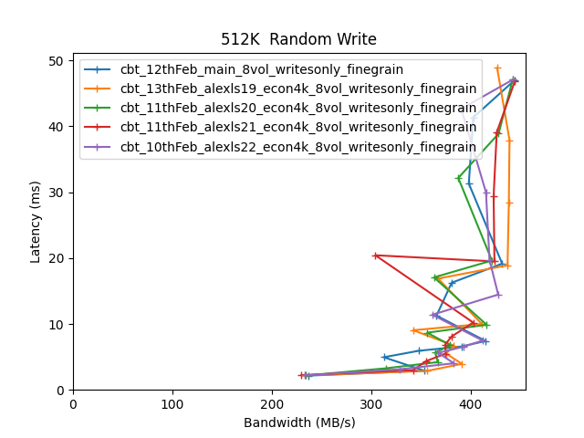||

## Random Read/Write

|||
| :---: | :---: |
|<a name="16384B-70-30-randrw"></a>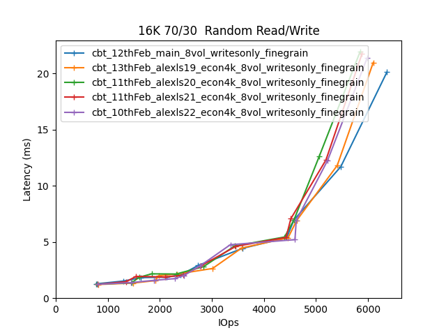||

# Configuration yaml files


Only yaml files that differ by more than 20 lines from the yaml file for the baseline directory will be added here in addition to the baseline yaml  

## results


```benchmarks:
  librbdfio:
    cmd_path: /usr/local/bin/fio
    fio_out_format: json
    log_avg_msec: 100
    log_bw: true
    log_iops: true
    log_lat: true
    norandommap: true
    osd_ra:
    - 4096
    poolname: rbd_replicated
    precond_time: 600
    prefill:
      blocksize: 64k
      numjobs: 1
    procs_per_volume:
    - 1
    ramp: 30
    time: 90
    time_based: true
    use_existing_volumes: true
    vol_size: 52500
    volumes_per_client:
    - 8
    workloads:
      16k7030:
        jobname: randmix
        mode: randrw
        numjobs:
        - 1
        op_size: 16384
        rwmixread: 70
        total_iodepth:
        - 1
        - 2
        - 3
        - 4
        - 5
        - 8
        - 16
        - 24
        - 32
        - 64
        - 128
      16krandomwrite:
        jobname: randwrite
        mode: randwrite
        numjobs:
        - 1
        op_size: 16384
        total_iodepth:
        - 1
        - 2
        - 3
        - 4
        - 5
        - 8
        - 16
        - 24
        - 32
        - 64
        - 128
      256krandomwrite:
        jobname: randwrite
        mode: randwrite
        numjobs:
        - 1
        op_size: 262144
        total_iodepth:
        - 1
        - 2
        - 3
        - 4
        - 5
        - 8
        - 16
        - 24
        - 32
        - 48
        - 64
        - 128
      32krandomwrite:
        jobname: randwrite
        mode: randwrite
        numjobs:
        - 1
        op_size: 32768
        total_iodepth:
        - 1
        - 2
        - 3
        - 4
        - 5
        - 8
        - 16
        - 24
        - 32
        - 64
        - 128
      4krandomwrite:
        jobname: randwrite
        mode: randwrite
        numjobs:
        - 1
        op_size: 4096
        total_iodepth:
        - 1
        - 2
        - 3
        - 4
        - 5
        - 8
        - 16
        - 24
        - 32
        - 64
        - 128
      512krandomwrite:
        jobname: randwrite
        mode: randwrite
        numjobs:
        - 1
        op_size: 524288
        total_iodepth:
        - 1
        - 2
        - 3
        - 4
        - 5
        - 6
        - 8
        - 12
        - 16
        - 24
        - 32
        - 40
      512kseqwrite:
        jobname: seqwrite
        mode: write
        numjobs:
        - 1
        op_size: 524288
        total_iodepth:
        - 1
        - 2
        - 3
        - 4
        - 5
        - 6
        - 7
        - 8
        - 10
        - 12
        - 14
      64krandomwrite:
        jobname: randwrite
        mode: randwrite
        numjobs:
        - 1
        op_size: 65536
        total_iodepth:
        - 1
        - 2
        - 3
        - 4
        - 5
        - 8
        - 16
        - 24
        - 32
        - 64
        - 128
      64kseqwrite:
        jobname: write
        mode: write
        numjobs:
        - 1
        op_size: 65536
        total_iodepth:
        - 1
        - 2
        - 3
        - 4
        - 5
        - 8
        - 16
        - 24
        - 32
        - 48
        - 64
      8krandomwrite:
        jobname: randwrite
        mode: randwrite
        numjobs:
        - 1
        op_size: 8192
        total_iodepth:
        - 1
        - 2
        - 3
        - 4
        - 5
        - 8
        - 16
        - 24
        - 32
        - 64
        - 128
      precondition:
        jobname: precond1rw
        mode: randwrite
        monitor: false
        numjobs:
        - 1
        op_size: 65536
        precond: true
        total_iodepth:
        - 16
      seq16kwrite:
        jobname: seqwrite
        mode: write
        numjobs:
        - 1
        op_size: 16384
        total_iodepth:
        - 2
        - 4
        - 8
        - 12
        - 16
        - 24
        - 32
        - 64
        - 96
        - 128
        - 192
      seq256kwrite:
        jobname: seqwrite
        mode: write
        numjobs:
        - 1
        op_size: 262144
        total_iodepth:
        - 1
        - 2
        - 3
        - 4
        - 5
        - 6
        - 7
        - 8
        - 10
        - 12
        - 14
      seq32kwrite:
        jobname: seqwrite
        mode: write
        numjobs:
        - 1
        op_size: 32768
        total_iodepth:
        - 1
        - 2
        - 3
        - 4
        - 5
        - 8
        - 16
        - 24
        - 32
        - 64
        - 128
      seq4kwrite:
        jobname: seqwrite
        mode: write
        numjobs:
        - 1
        op_size: 4096
        total_iodepth:
        - 2
        - 4
        - 8
        - 12
        - 16
        - 24
        - 32
        - 64
        - 96
        - 128
        - 192
        - 256
      seq8kwrite:
        jobname: seqwrite
        mode: write
        numjobs:
        - 1
        op_size: 8192
        total_iodepth:
        - 2
        - 4
        - 8
        - 12
        - 16
        - 24
        - 32
        - 64
        - 96
        - 128
        - 192
        - 256
cluster:
  archive_dir: /tmp/cbt
  ceph-mgr_cmd: /usr/bin/ceph-mgr
  ceph-mon_cmd: /usr/bin/ceph-mon
  ceph-osd_cmd: /usr/bin/ceph-osd
  ceph-run_cmd: /usr/bin/ceph-run
  ceph_cmd: /usr/bin/ceph
  clients:
  - --- server1 ---
  clusterid: ceph
  conf_file: /cbt/ceph.conf.4x1x1.fs
  fs: xfs
  head: --- server1 ---
  iterations: 1
  mgrs:
    --- server1 ---:
      a: null
  mkfs_opts: -f -i size=2048
  mons:
    --- server1 ---:
      a: --- IP Address --:6789
  mount_opts: -o inode64,noatime,logbsize=256k
  osds:
  - --- server1 ---
  osds_per_node: 6
  pdsh_ssh_args: -a -x -l%u %h
  rados_cmd: /usr/bin/rados
  rbd_cmd: /usr/bin/rbd
  tmp_dir: /tmp/cbt
  use_existing: true
  user: root
monitoring_profiles:
  collectl:
    args: -c 18 -sCD -i 10 -P -oz -F0 --rawtoo --sep ";" -f {collectl_dir}
```

```benchmarks:
  librbdfio:
    cmd_path: /usr/local/bin/fio
    fio_out_format: json
    log_avg_msec: 100
    log_bw: true
    log_iops: true
    log_lat: true
    norandommap: true
    osd_ra:
    - 4096
    poolname: rbd_replicated
    precond_time: 600
    prefill:
      blocksize: 64k
      numjobs: 1
    procs_per_volume:
    - 1
    ramp: 30
    time: 90
    time_based: true
    use_existing_volumes: true
    vol_size: 52500
    volumes_per_client:
    - 8
    workloads:
      16k7030:
        jobname: randmix
        mode: randrw
        numjobs:
        - 1
        op_size: 16384
        rwmixread: 70
        total_iodepth:
        - 1
        - 2
        - 3
        - 4
        - 5
        - 8
        - 16
        - 24
        - 32
        - 64
        - 128
      16krandomwrite:
        jobname: randwrite
        mode: randwrite
        numjobs:
        - 1
        op_size: 16384
        total_iodepth:
        - 1
        - 2
        - 3
        - 4
        - 5
        - 8
        - 16
        - 24
        - 32
        - 64
        - 128
      256krandomwrite:
        jobname: randwrite
        mode: randwrite
        numjobs:
        - 1
        op_size: 262144
        total_iodepth:
        - 1
        - 2
        - 3
        - 4
        - 5
        - 8
        - 16
        - 24
        - 32
        - 48
        - 64
        - 128
      32krandomwrite:
        jobname: randwrite
        mode: randwrite
        numjobs:
        - 1
        op_size: 32768
        total_iodepth:
        - 1
        - 2
        - 3
        - 4
        - 5
        - 8
        - 16
        - 24
        - 32
        - 64
        - 128
      4krandomwrite:
        jobname: randwrite
        mode: randwrite
        numjobs:
        - 1
        op_size: 4096
        total_iodepth:
        - 1
        - 2
        - 3
        - 4
        - 5
        - 8
        - 16
        - 24
        - 32
        - 64
        - 128
      512krandomwrite:
        jobname: randwrite
        mode: randwrite
        numjobs:
        - 1
        op_size: 524288
        total_iodepth:
        - 1
        - 2
        - 3
        - 4
        - 5
        - 6
        - 8
        - 12
        - 16
        - 24
        - 32
        - 40
      512kseqwrite:
        jobname: seqwrite
        mode: write
        numjobs:
        - 1
        op_size: 524288
        total_iodepth:
        - 1
        - 2
        - 3
        - 4
        - 5
        - 6
        - 7
        - 8
        - 10
        - 12
        - 14
      64krandomwrite:
        jobname: randwrite
        mode: randwrite
        numjobs:
        - 1
        op_size: 65536
        total_iodepth:
        - 1
        - 2
        - 3
        - 4
        - 5
        - 8
        - 16
        - 24
        - 32
        - 64
        - 128
      64kseqwrite:
        jobname: write
        mode: write
        numjobs:
        - 1
        op_size: 65536
        total_iodepth:
        - 1
        - 2
        - 3
        - 4
        - 5
        - 8
        - 16
        - 24
        - 32
        - 48
        - 64
      8krandomwrite:
        jobname: randwrite
        mode: randwrite
        numjobs:
        - 1
        op_size: 8192
        total_iodepth:
        - 1
        - 2
        - 3
        - 4
        - 5
        - 8
        - 16
        - 24
        - 32
        - 64
        - 128
      precondition:
        jobname: precond1rw
        mode: randwrite
        monitor: false
        numjobs:
        - 1
        op_size: 65536
        precond: true
        total_iodepth:
        - 16
      seq16kwrite:
        jobname: seqwrite
        mode: write
        numjobs:
        - 1
        op_size: 16384
        total_iodepth:
        - 2
        - 4
        - 8
        - 12
        - 16
        - 24
        - 32
        - 64
        - 96
        - 128
        - 192
      seq256kwrite:
        jobname: seqwrite
        mode: write
        numjobs:
        - 1
        op_size: 262144
        total_iodepth:
        - 1
        - 2
        - 3
        - 4
        - 5
        - 6
        - 7
        - 8
        - 10
        - 12
        - 14
      seq32kwrite:
        jobname: seqwrite
        mode: write
        numjobs:
        - 1
        op_size: 32768
        total_iodepth:
        - 1
        - 2
        - 3
        - 4
        - 5
        - 8
        - 16
        - 24
        - 32
        - 64
        - 128
      seq4kwrite:
        jobname: seqwrite
        mode: write
        numjobs:
        - 1
        op_size: 4096
        total_iodepth:
        - 2
        - 4
        - 8
        - 12
        - 16
        - 24
        - 32
        - 64
        - 96
        - 128
        - 192
        - 256
      seq8kwrite:
        jobname: seqwrite
        mode: write
        numjobs:
        - 1
        op_size: 8192
        total_iodepth:
        - 2
        - 4
        - 8
        - 12
        - 16
        - 24
        - 32
        - 64
        - 96
        - 128
        - 192
        - 256
cluster:
  archive_dir: /tmp/cbt
  ceph-mgr_cmd: /usr/bin/ceph-mgr
  ceph-mon_cmd: /usr/bin/ceph-mon
  ceph-osd_cmd: /usr/bin/ceph-osd
  ceph-run_cmd: /usr/bin/ceph-run
  ceph_cmd: /usr/bin/ceph
  clients:
  - --- server1 ---
  clusterid: ceph
  conf_file: /cbt/ceph.conf.4x1x1.fs
  fs: xfs
  head: --- server1 ---
  iterations: 1
  mgrs:
    --- server1 ---:
      a: null
  mkfs_opts: -f -i size=2048
  mons:
    --- server1 ---:
      a: --- IP Address --:6789
  mount_opts: -o inode64,noatime,logbsize=256k
  osds:
  - --- server1 ---
  osds_per_node: 6
  pdsh_ssh_args: -a -x -l%u %h
  rados_cmd: /usr/bin/rados
  rbd_cmd: /usr/bin/rbd
  tmp_dir: /tmp/cbt
  use_existing: true
  user: root
monitoring_profiles:
  collectl:
    args: -c 18 -sCD -i 10 -P -oz -F0 --rawtoo --sep ";" -f {collectl_dir}
```