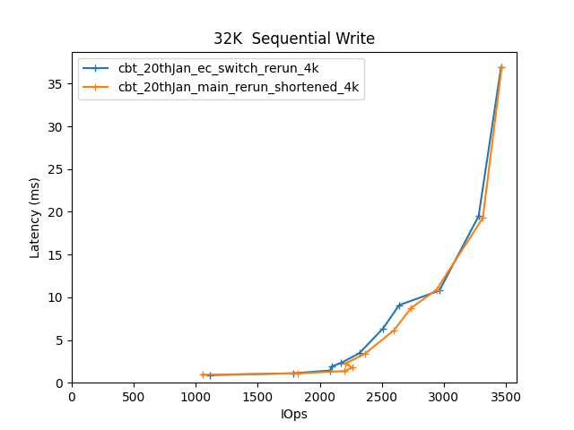
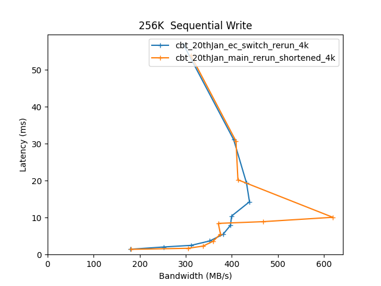
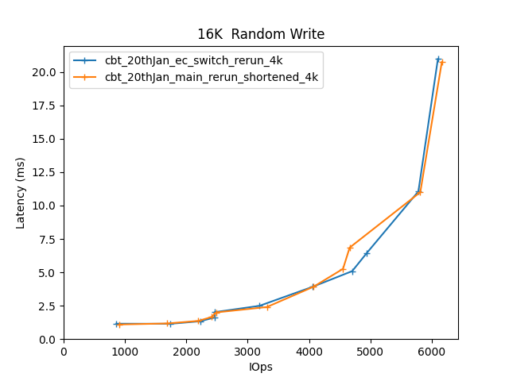
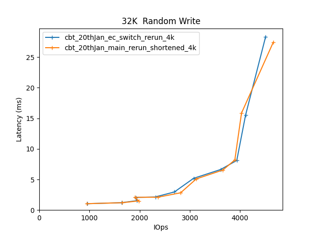
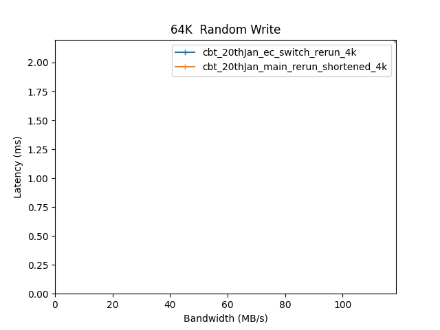
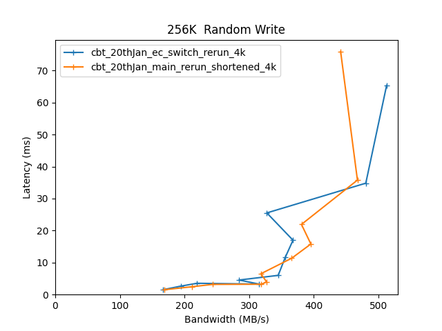

Comparitive Performance Report for cbt-20thJan-ec-switch-rerun-4k vs cbt-20thJan-main-rerun-shortened-4k
========================================================================================================

Table of contents
=================

* [Comparison summary for cbt-20thJan-ec-switch-rerun-4k vs cbt-20thJan-main-rerun-shortened-4k](#comparison-summary-for-cbt-20thjan-ec-switch-rerun-4k-vs-cbt-20thjan-main-rerun-shortened-4k)
* [Response Curves](#response-curves)
	* [Sequential Write](#sequential-write)
	* [Random Write](#random-write)
* [Configuration yaml files](#configuration-yaml-files)
	* [results](#results)
	* [results](#results)

# Comparison summary for cbt-20thJan-ec-switch-rerun-4k vs cbt-20thJan-main-rerun-shortened-4k
  
  
|Sequential Write|cbt_20thJan_ec_switch_rerun_4k|cbt_20thJan_main_rerun_shortened_4k|  
| :--- | ---: | ---: |  
|[32K](#32768B-write)|3461 IOps@37.0ms|3466 IOps@36.9ms|  
|[256K](#262144B-write)|438 MB/s@14.3ms|619 MB/s@10.1ms|  
  
  
|Random Write|cbt_20thJan_ec_switch_rerun_4k|cbt_20thJan_main_rerun_shortened_4k|  
| :--- | ---: | ---: |  
|[16K](#16384B-randwrite)|6099 IOps@21.0ms|6163 IOps@20.8ms|  
|[32K](#32768B-randwrite)|4510 IOps@28.4ms|4662 IOps@27.4ms|  
|[64K](#65536B-randwrite)|118 MB/s@2.2ms|119 MB/s@2.2ms|  
|[256K](#262144B-randwrite)|513 MB/s@65.4ms|468 MB/s@35.8ms|  
  
  

# Response Curves

## Sequential Write

|||
| :---: | :---: |
|<a name="32768B-write"></a>|<a name="262144B-write"></a>|

## Random Write

|||
| :---: | :---: |
|<a name="16384B-randwrite"></a>|<a name="32768B-randwrite"></a>|
|<a name="65536B-randwrite"></a>|<a name="262144B-randwrite"></a>|

# Configuration yaml files

## results


```benchmarks:
  librbdfio:
    cmd_path: /usr/local/bin/fio
    fio_out_format: json
    log_avg_msec: 100
    log_bw: true
    log_iops: true
    log_lat: true
    norandommap: true
    osd_ra:
    - 4096
    poolname: rbd_replicated
    precond_time: 600
    prefill:
      blocksize: 64k
      numjobs: 1
    procs_per_volume:
    - 1
    ramp: 30
    time: 60
    time_based: true
    use_existing_volumes: true
    vol_size: 420000
    volumes_per_client:
    - 1
    workloads:
      16krandomwrite:
        iodepth:
        - 1
        - 2
        - 3
        - 4
        - 5
        - 8
        - 16
        - 24
        - 32
        - 64
        - 128
        jobname: randwrite
        mode: randwrite
        numjobs:
        - 1
        - 1
        - 1
        - 1
        - 1
        - 1
        - 1
        - 1
        - 1
        - 1
        - 1
        op_size: 16384
      256krandomwrite:
        iodepth:
        - 1
        - 2
        - 3
        - 4
        - 5
        - 8
        - 16
        - 24
        - 32
        - 64
        - 128
        jobname: randwrite
        mode: randwrite
        numjobs:
        - 1
        - 1
        - 1
        - 1
        - 1
        - 1
        - 1
        - 1
        - 1
        - 1
        - 1
        op_size: 262144
      32krandomwrite:
        iodepth:
        - 1
        - 2
        - 3
        - 4
        - 5
        - 8
        - 16
        - 24
        - 32
        - 64
        - 128
        jobname: randwrite
        mode: randwrite
        numjobs:
        - 1
        - 1
        - 1
        - 1
        - 1
        - 1
        - 1
        - 1
        - 1
        - 1
        - 1
        op_size: 32768
      precondition:
        iodepth:
        - 4
        jobname: precond1rw
        mode: randwrite
        monitor: false
        numjobs:
        - 1
        op_size: 65536
        precond: true
      seq256kwrite:
        iodepth:
        - 1
        - 2
        - 3
        - 5
        - 8
        - 12
        - 16
        - 24
        - 32
        - 48
        - 64
        jobname: seqwrite
        mode: write
        numjobs:
        - 1
        - 1
        - 1
        - 1
        - 1
        - 1
        - 1
        - 1
        - 1
        - 1
        - 1
        op_size: 262144
      seq32kwrite:
        iodepth:
        - 1
        - 2
        - 3
        - 4
        - 5
        - 8
        - 16
        - 24
        - 32
        - 64
        - 128
        jobname: seqwrite
        mode: write
        numjobs:
        - 1
        - 1
        - 1
        - 1
        - 1
        - 1
        - 1
        - 1
        - 1
        - 1
        - 1
        op_size: 32768
cluster:
  archive_dir: /tmp/cbt
  ceph-mgr_cmd: /usr/bin/ceph-mgr
  ceph-mon_cmd: /usr/bin/ceph-mon
  ceph-osd_cmd: /usr/bin/ceph-osd
  ceph-run_cmd: /usr/bin/ceph-run
  ceph_cmd: /usr/bin/ceph
  clients:
  - --- server1 ---
  clusterid: ceph
  conf_file: /cbt/ceph.conf.4x1x1.fs
  fs: xfs
  head: --- server1 ---
  iterations: 1
  mgrs:
    --- server1 ---:
      a: null
  mkfs_opts: -f -i size=2048
  mons:
    --- server1 ---:
      a: --- IP Address --:6789
  mount_opts: -o inode64,noatime,logbsize=256k
  osds:
  - --- server1 ---
  osds_per_node: 6
  pdsh_ssh_args: -a -x -l%u %h
  rados_cmd: /usr/bin/rados
  rbd_cmd: /usr/bin/rbd
  tmp_dir: /tmp/cbt
  use_existing: true
  user: root
monitoring_profiles:
  collectl:
    args: -c 18 -sCD -i 10 -P -oz -F0 --rawtoo --sep ";" -f {collectl_dir}
```
## results


```benchmarks:
  librbdfio:
    cmd_path: /usr/local/bin/fio
    fio_out_format: json
    log_avg_msec: 100
    log_bw: true
    log_iops: true
    log_lat: true
    norandommap: true
    osd_ra:
    - 4096
    poolname: rbd_replicated
    precond_time: 600
    prefill:
      blocksize: 64k
      numjobs: 1
    procs_per_volume:
    - 1
    ramp: 30
    time: 60
    time_based: true
    use_existing_volumes: true
    vol_size: 420000
    volumes_per_client:
    - 1
    workloads:
      16krandomwrite:
        iodepth:
        - 1
        - 2
        - 3
        - 4
        - 5
        - 8
        - 16
        - 24
        - 32
        - 64
        - 128
        jobname: randwrite
        mode: randwrite
        numjobs:
        - 1
        - 1
        - 1
        - 1
        - 1
        - 1
        - 1
        - 1
        - 1
        - 1
        - 1
        op_size: 16384
      256krandomwrite:
        iodepth:
        - 1
        - 2
        - 3
        - 4
        - 5
        - 8
        - 16
        - 24
        - 32
        - 64
        - 128
        jobname: randwrite
        mode: randwrite
        numjobs:
        - 1
        - 1
        - 1
        - 1
        - 1
        - 1
        - 1
        - 1
        - 1
        - 1
        - 1
        op_size: 262144
      32krandomwrite:
        iodepth:
        - 1
        - 2
        - 3
        - 4
        - 5
        - 8
        - 16
        - 24
        - 32
        - 64
        - 128
        jobname: randwrite
        mode: randwrite
        numjobs:
        - 1
        - 1
        - 1
        - 1
        - 1
        - 1
        - 1
        - 1
        - 1
        - 1
        - 1
        op_size: 32768
      precondition:
        iodepth:
        - 4
        jobname: precond1rw
        mode: randwrite
        monitor: false
        numjobs:
        - 1
        op_size: 65536
        precond: true
      seq256kwrite:
        iodepth:
        - 1
        - 2
        - 3
        - 5
        - 8
        - 12
        - 16
        - 24
        - 32
        - 48
        - 64
        jobname: seqwrite
        mode: write
        numjobs:
        - 1
        - 1
        - 1
        - 1
        - 1
        - 1
        - 1
        - 1
        - 1
        - 1
        - 1
        op_size: 262144
      seq32kwrite:
        iodepth:
        - 1
        - 2
        - 3
        - 4
        - 5
        - 8
        - 16
        - 24
        - 32
        - 64
        - 128
        jobname: seqwrite
        mode: write
        numjobs:
        - 1
        - 1
        - 1
        - 1
        - 1
        - 1
        - 1
        - 1
        - 1
        - 1
        - 1
        op_size: 32768
cluster:
  archive_dir: /tmp/cbt
  ceph-mgr_cmd: /usr/bin/ceph-mgr
  ceph-mon_cmd: /usr/bin/ceph-mon
  ceph-osd_cmd: /usr/bin/ceph-osd
  ceph-run_cmd: /usr/bin/ceph-run
  ceph_cmd: /usr/bin/ceph
  clients:
  - --- server1 ---
  clusterid: ceph
  conf_file: /cbt/ceph.conf.4x1x1.fs
  fs: xfs
  head: --- server1 ---
  iterations: 1
  mgrs:
    --- server1 ---:
      a: null
  mkfs_opts: -f -i size=2048
  mons:
    --- server1 ---:
      a: --- IP Address --:6789
  mount_opts: -o inode64,noatime,logbsize=256k
  osds:
  - --- server1 ---
  osds_per_node: 6
  pdsh_ssh_args: -a -x -l%u %h
  rados_cmd: /usr/bin/rados
  rbd_cmd: /usr/bin/rbd
  tmp_dir: /tmp/cbt
  use_existing: true
  user: root
monitoring_profiles:
  collectl:
    args: -c 18 -sCD -i 10 -P -oz -F0 --rawtoo --sep ";" -f {collectl_dir}
```