Performance Report for cbt-28thJan-alexls17-econ-4k-8vol-reverse-3min
=====================================================================

Table of contents
=================

* [Summary of results for cbt-28thJan-alexls17-econ-4k-8vol-reverse-3min](#summary-of-results-for-cbt-28thjan-alexls17-econ-4k-8vol-reverse-3min)
* [Response Curves](#response-curves)
	* [Sequential Write](#sequential-write)
	* [Random Write](#random-write)
	* [Random Read/Write](#random-readwrite)
* [Configuration yaml](#configuration-yaml)

# Summary of results for cbt-28thJan-alexls17-econ-4k-8vol-reverse-3min
  
|Workload Name|Maximum Throughput|Latency (ms)|  
| :--- | ---: | ---: |  
|[4096B_write](#4096B-write)|7292 IOps|21.9|  
|[8192B_write](#8192B-write)|4923 IOps|32.5|  
|[16384B_write](#16384B-write)|6740 IOps|19.0|  
|[32768B_write](#32768B-write)|9196 IOps|13.9|  
|[65536B_write](#65536B-write)|208 MB/s|30.1|  
|[262144B_write](#262144B-write)|461 MB/s|18.1|  
|[524288B_write](#524288B-write)|465 MB/s|53.9|  
|[1048576B_write](#1048576B-write)|475 MB/s|87.7|  
|[4096B_randwrite](#4096B-randwrite)|3296 IOps|38.8|  
|[8192B_randwrite](#8192B-randwrite)|3734 IOps|34.3|  
|[16384B_randwrite](#16384B-randwrite)|4827 IOps|13.2|  
|[32768B_randwrite](#32768B-randwrite)|3579 IOps|26.8|  
|[65536B_randwrite](#65536B-randwrite)|240 MB/s|10.8|  
|[262144B_randwrite](#262144B-randwrite)|421 MB/s|14.8|  
|[524288B_randwrite](#524288B-randwrite)|466 MB/s|80.8|  
|[1048576B_randwrite](#1048576B-randwrite)|472 MB/s|177.5|  
|[16384B_70_30_randrw](#16384B-70-30-randrw)|5639 IOps|14.2|  
|[65536B_30_70_randrw](#65536B-30-70-randrw)|245 MB/s|17.1|  
|[65536B_70_30_randrw](#65536B-70-30-randrw)|282 MB/s|20.5|
# Response Curves

## Sequential Write

|||
| :---: | :---: |
|<a name="4096B-write"></a>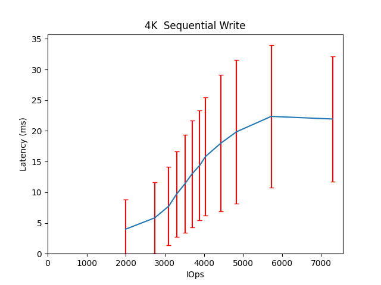|<a name="8192B-write"></a>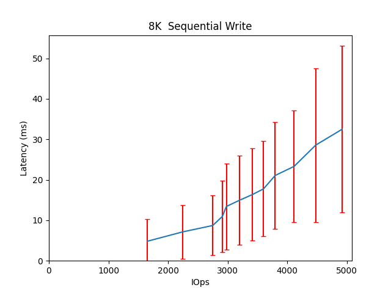|
|<a name="16384B-write"></a>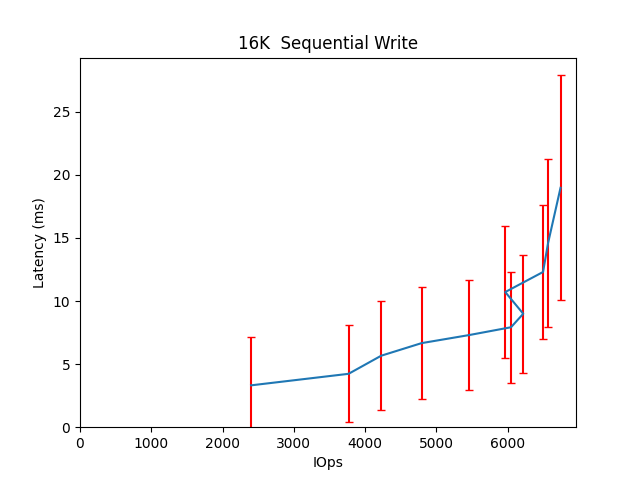|<a name="32768B-write"></a>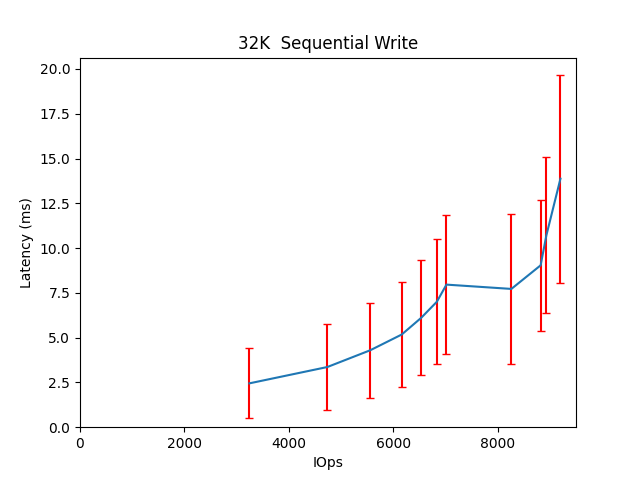|
|<a name="65536B-write"></a>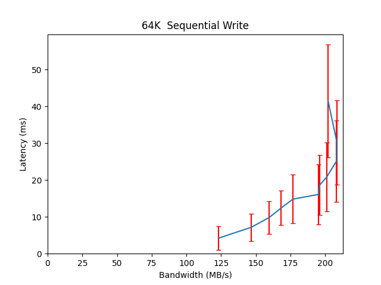|<a name="262144B-write"></a>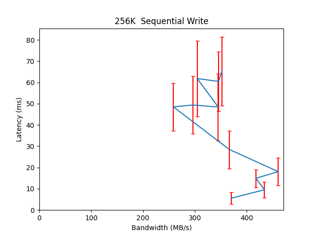|
|<a name="524288B-write"></a>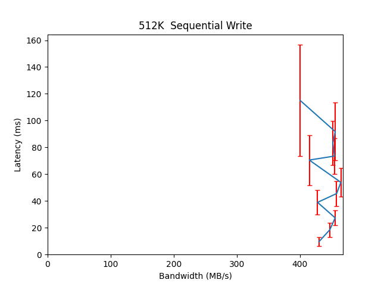|<a name="1048576B-write"></a>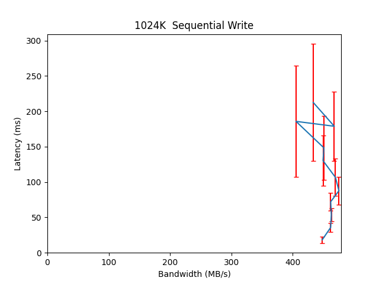|

## Random Write

|||
| :---: | :---: |
|<a name="4096B-randwrite"></a>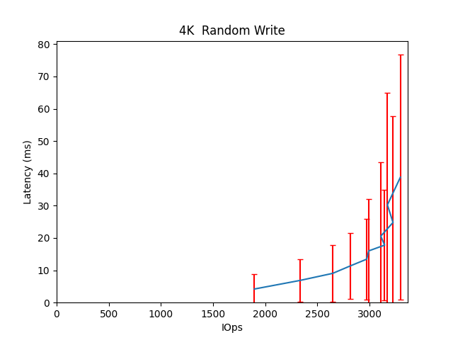|<a name="8192B-randwrite"></a>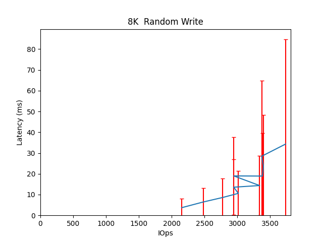|
|<a name="16384B-randwrite"></a>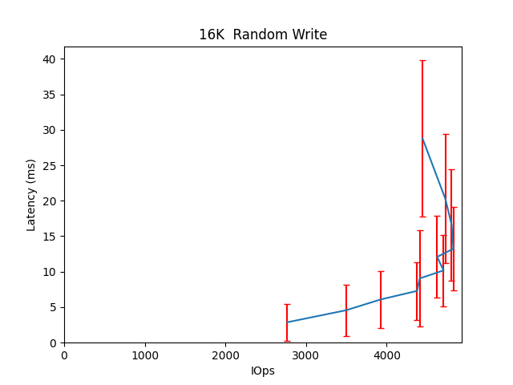|<a name="32768B-randwrite"></a>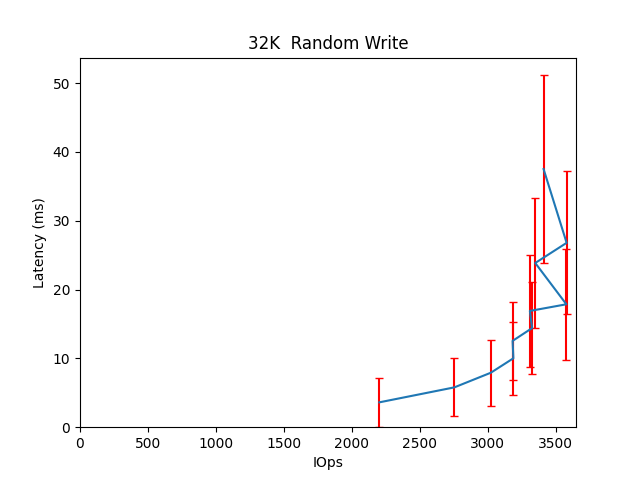|
|<a name="65536B-randwrite"></a>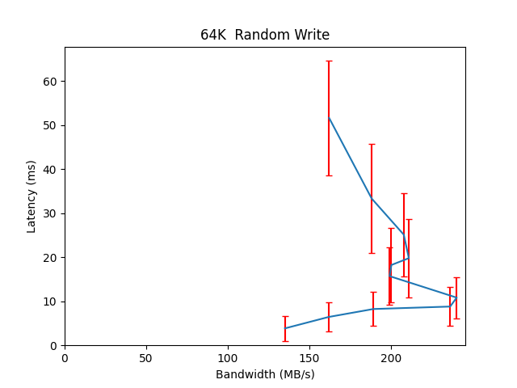|<a name="262144B-randwrite"></a>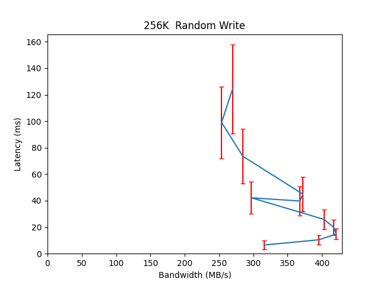|
|<a name="524288B-randwrite"></a>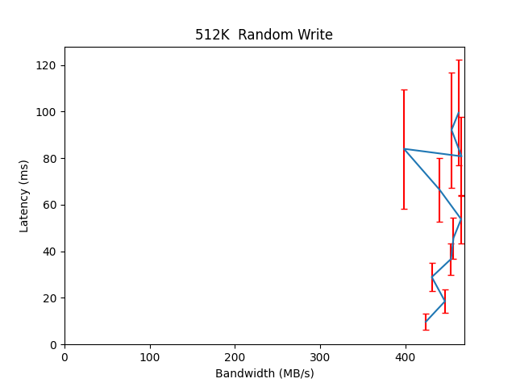|<a name="1048576B-randwrite"></a>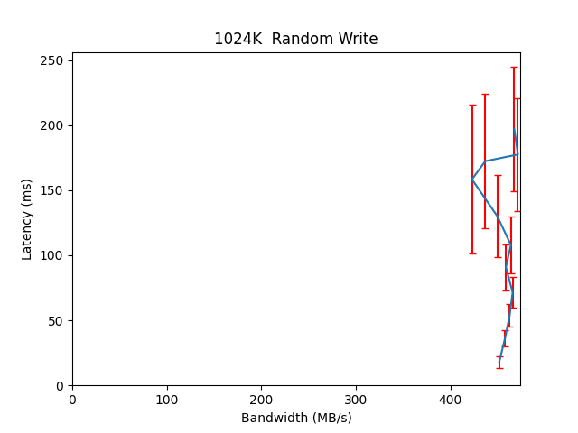|

## Random Read/Write

|||
| :---: | :---: |
|<a name="16384B-70-30-randrw"></a>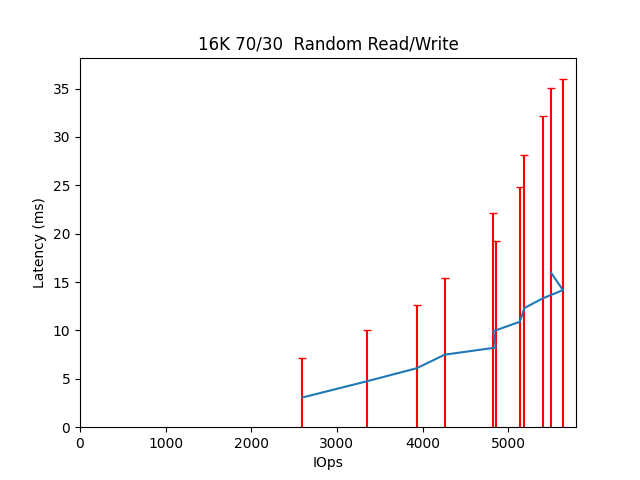|<a name="65536B-70-30-randrw"></a>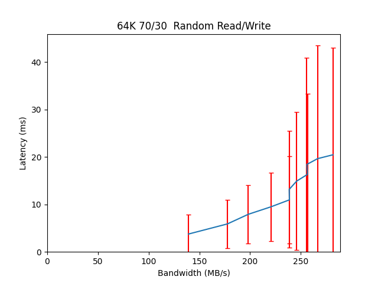|
|<a name="65536B-30-70-randrw"></a>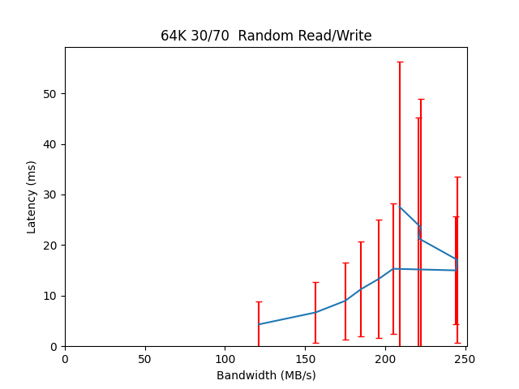||

# Configuration yaml


```benchmarks:
  librbdfio:
    cmd_path: /usr/local/bin/fio
    fio_out_format: json
    log_avg_msec: 100
    log_bw: true
    log_iops: true
    log_lat: true
    norandommap: true
    osd_ra:
    - 4096
    poolname: rbd_replicated
    precond_time: 600
    prefill:
      blocksize: 64k
      numjobs: 1
    procs_per_volume:
    - 1
    ramp: 30
    time: 180
    time_based: true
    use_existing_volumes: true
    vol_size: 52500
    volumes_per_client:
    - 8
    workloads:
      16k7030:
        iodepth:
        - 11
        - 10
        - 9
        - 8
        - 7
        - 6
        - 5
        - 4
        - 3
        - 2
        - 1
        jobname: randmix
        mode: randrw
        numjobs:
        - 1
        op_size: 16384
        rwmixread: 70
      16krandomwrite:
        iodepth:
        - 16
        - 12
        - 10
        - 8
        - 7
        - 6
        - 5
        - 4
        - 3
        - 2
        - 1
        jobname: randwrite
        mode: randwrite
        numjobs:
        - 1
        op_size: 16384
      1Mrandomwrite:
        iodepth:
        - 11
        - 10
        - 9
        - 8
        - 7
        - 6
        - 5
        - 4
        - 3
        - 2
        - 1
        jobname: randwrite
        mode: randwrite
        numjobs:
        - 1
        op_size: 1048576
      1Mseqwrite:
        iodepth:
        - 11
        - 10
        - 9
        - 8
        - 7
        - 6
        - 5
        - 4
        - 3
        - 2
        - 1
        jobname: seqwrite
        mode: write
        numjobs:
        - 1
        op_size: 1048576
      256krandomwrite:
        iodepth:
        - 16
        - 12
        - 10
        - 8
        - 7
        - 6
        - 5
        - 4
        - 3
        - 2
        - 1
        jobname: randwrite
        mode: randwrite
        numjobs:
        - 1
        op_size: 262144
      32krandomwrite:
        iodepth:
        - 16
        - 12
        - 10
        - 8
        - 7
        - 6
        - 5
        - 4
        - 3
        - 2
        - 1
        jobname: randwrite
        mode: randwrite
        numjobs:
        - 1
        op_size: 32768
      4krandomwrite:
        iodepth:
        - 16
        - 12
        - 10
        - 8
        - 7
        - 6
        - 5
        - 4
        - 3
        - 2
        - 1
        jobname: randwrite
        mode: randwrite
        numjobs:
        - 1
        op_size: 4096
      512krandomwrite:
        iodepth:
        - 11
        - 10
        - 9
        - 8
        - 7
        - 6
        - 5
        - 4
        - 3
        - 2
        - 1
        jobname: randwrite
        mode: randwrite
        numjobs:
        - 1
        op_size: 524288
      512kseqwrite:
        iodepth:
        - 11
        - 10
        - 9
        - 8
        - 7
        - 6
        - 5
        - 4
        - 3
        - 2
        - 1
        jobname: seqwrite
        mode: write
        numjobs:
        - 1
        op_size: 524288
      64k3070:
        iodepth:
        - 11
        - 10
        - 9
        - 8
        - 7
        - 6
        - 5
        - 4
        - 3
        - 2
        - 1
        jobname: randmix
        mode: randrw
        numjobs:
        - 1
        op_size: 65536
        rwmixread: 30
      64k7030:
        iodepth:
        - 11
        - 10
        - 9
        - 8
        - 7
        - 6
        - 5
        - 4
        - 3
        - 2
        - 1
        jobname: randmix
        mode: randrw
        numjobs:
        - 1
        op_size: 65536
        rwmixread: 70
      64krandomwrite:
        iodepth:
        - 16
        - 12
        - 10
        - 8
        - 7
        - 6
        - 5
        - 4
        - 3
        - 2
        - 1
        jobname: randwrite
        mode: randwrite
        numjobs:
        - 1
        op_size: 65536
      64kseqwrite:
        iodepth:
        - 16
        - 12
        - 10
        - 8
        - 7
        - 6
        - 5
        - 4
        - 3
        - 2
        - 1
        jobname: write
        mode: write
        numjobs:
        - 1
        op_size: 65536
      8krandomwrite:
        iodepth:
        - 16
        - 12
        - 10
        - 8
        - 7
        - 6
        - 5
        - 4
        - 3
        - 2
        - 1
        jobname: randwrite
        mode: randwrite
        numjobs:
        - 1
        op_size: 8192
      precondition:
        iodepth:
        - 2
        jobname: precond1rw
        mode: randwrite
        monitor: false
        numjobs:
        - 1
        op_size: 65536
        precond: true
      seq16kwrite:
        iodepth:
        - 16
        - 12
        - 10
        - 8
        - 7
        - 6
        - 5
        - 4
        - 3
        - 2
        - 1
        jobname: seqwrite
        mode: write
        numjobs:
        - 1
        op_size: 16384
      seq256kwrite:
        iodepth:
        - 11
        - 10
        - 9
        - 8
        - 7
        - 6
        - 5
        - 4
        - 3
        - 2
        - 1
        jobname: seqwrite
        mode: write
        numjobs:
        - 1
        op_size: 262144
      seq32kwrite:
        iodepth:
        - 16
        - 12
        - 10
        - 8
        - 7
        - 6
        - 5
        - 4
        - 3
        - 2
        - 1
        jobname: seqwrite
        mode: write
        numjobs:
        - 1
        op_size: 32768
      seq4kwrite:
        iodepth:
        - 20
        - 16
        - 12
        - 10
        - 8
        - 7
        - 6
        - 5
        - 4
        - 3
        - 2
        - 1
        jobname: seqwrite
        mode: write
        numjobs:
        - 1
        op_size: 4096
      seq8kwrite:
        iodepth:
        - 20
        - 16
        - 12
        - 10
        - 8
        - 7
        - 6
        - 5
        - 4
        - 3
        - 2
        - 1
        jobname: seqwrite
        mode: write
        numjobs:
        - 1
        op_size: 8192
cluster:
  archive_dir: /tmp/cbt
  ceph-mgr_cmd: /usr/bin/ceph-mgr
  ceph-mon_cmd: /usr/bin/ceph-mon
  ceph-osd_cmd: /usr/bin/ceph-osd
  ceph-run_cmd: /usr/bin/ceph-run
  ceph_cmd: /usr/bin/ceph
  clients:
  - --- server1 ---
  clusterid: ceph
  conf_file: /cbt/ceph.conf.4x1x1.fs
  fs: xfs
  head: --- server1 ---
  iterations: 1
  mgrs:
    --- server1 ---:
      a: null
  mkfs_opts: -f -i size=2048
  mons:
    --- server1 ---:
      a: --- IP Address --:6789
  mount_opts: -o inode64,noatime,logbsize=256k
  osds:
  - --- server1 ---
  osds_per_node: 6
  pdsh_ssh_args: -a -x -l%u %h
  rados_cmd: /usr/bin/rados
  rbd_cmd: /usr/bin/rbd
  tmp_dir: /tmp/cbt
  use_existing: true
  user: root
monitoring_profiles:
  collectl:
    args: -c 18 -sCD -i 10 -P -oz -F0 --rawtoo --sep ";" -f {collectl_dir}
```