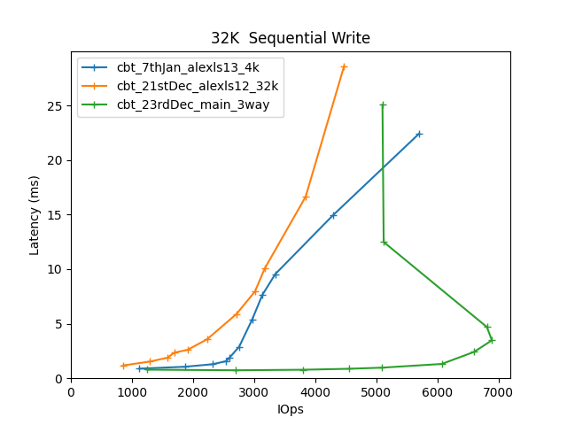

Comparitive Performance Report for cbt-7thJan-alexls13-4k vs cbt-21stDec-alexls12-32k vs cbt-23rdDec-main-3way
==============================================================================================================

Table of contents
=================

* [Comparison summary for cbt-7thJan-alexls13-4k vs cbt-21stDec-alexls12-32k vs cbt-23rdDec-main-3way](#comparison-summary-for-cbt-7thjan-alexls13-4k-vs-cbt-21stdec-alexls12-32k-vs-cbt-23rddec-main-3way)
* [Response Curves](#response-curves)
	* [Sequential Read](#sequential-read)
	* [Sequential Write](#sequential-write)
	* [Random Read](#random-read)
	* [Random Write](#random-write)
	* [Random Read/Write](#random-readwrite)
* [Configuration yaml files](#configuration-yaml-files)
	* [results](#results)
	* [results](#results)
	* [results](#results)

# Comparison summary for cbt-7thJan-alexls13-4k vs cbt-21stDec-alexls12-32k vs cbt-23rdDec-main-3way
  
|Sequential Read|cbt_21stDec_alexls12_32k|cbt_23rdDec_main_3way|cbt_7thJan_alexls13_4k|  
| :--- | ---: | ---: | ---: |  
|[4K](#4096B-read)|26256 IOps@7.3ms|14325 IOps@13.4ms|24765 IOps@7.7ms|  
|[8K](#8192B-read)|23463 IOps@8.2ms|11027 IOps@17.4ms|16476 IOps@11.6ms|  
|[16K](#16384B-read)|24998 IOps@7.7ms|12035 IOps@15.9ms|11084 IOps@17.3ms|  
|[32K](#32768B-read)|27040 IOps@7.1ms|13391 IOps@14.3ms|11215 IOps@17.1ms|  
|[64K](#65536B-read)|1389 MB/s@12.1ms|1028 MB/s@16.3ms|971 MB/s@17.3ms|  
|[256K](#262144B-read)|1545 MB/s@10.9ms|1384 MB/s@12.1ms|1474 MB/s@11.4ms|  
|[512K](#524288B-read)|1586 MB/s@10.6ms|1497 MB/s@16.8ms|1494 MB/s@11.2ms|  
|[1024K](#1048576B-read)|1595 MB/s@13.1ms|1482 MB/s@17.0ms|1518 MB/s@13.8ms|  
  
|Sequential Write|cbt_21stDec_alexls12_32k|cbt_23rdDec_main_3way|cbt_7thJan_alexls13_4k|  
| :--- | ---: | ---: | ---: |  
|[4K](#4096B-write)|3947 IOps@64.8ms|9078 IOps@28.2ms|822 IOps@310.7ms|  
|[8K](#8192B-write)|4213 IOps@60.8ms|8827 IOps@21.7ms|1600 IOps@2.5ms|  
|[16K](#16384B-write)|3873 IOps@49.6ms|7173 IOps@26.8ms|4786 IOps@40.1ms|  
|[32K](#32768B-write)|4473 IOps@28.6ms|6893 IOps@3.5ms|5703 IOps@22.4ms|  
|[64K](#65536B-write)|153 MB/s@54.8ms|135 MB/s@31.0ms|189 MB/s@44.3ms|  
|[256K](#262144B-write)|585 MB/s@5.3ms|216 MB/s@2.4ms|467 MB/s@8.9ms|  
|[512K](#524288B-write)|450 MB/s@37.1ms|208 MB/s@80.5ms|417 MB/s@7.5ms|  
|[1024K](#1048576B-write)|483 MB/s@43.1ms|184 MB/s@79.5ms|524 MB/s@31.7ms|  
  
|Random Read|cbt_21stDec_alexls12_32k|cbt_23rdDec_main_3way|cbt_7thJan_alexls13_4k|  
| :--- | ---: | ---: | ---: |  
|[4K](#4096B-randread)|96488 IOps@4.0ms|133119 IOps@2.9ms|92303 IOps@4.2ms|  
|[8K](#8192B-randread)|88567 IOps@4.3ms|121487 IOps@3.2ms|56565 IOps@6.8ms|  
|[16K](#16384B-randread)|81282 IOps@4.7ms|95513 IOps@2.7ms|31265 IOps@8.2ms|  
|[32K](#32768B-randread)|53553 IOps@4.8ms|50671 IOps@5.1ms|29166 IOps@8.8ms|  
|[64K](#65536B-randread)|1750 MB/s@9.6ms|1679 MB/s@10.0ms|1607 MB/s@10.4ms|  
|[256K](#262144B-randread)|1746 MB/s@9.6ms|1689 MB/s@19.9ms|1697 MB/s@19.8ms|  
|[512K](#524288B-randread)|1729 MB/s@19.4ms|1686 MB/s@19.9ms|1701 MB/s@19.7ms|  
|[1024K](#1048576B-randread)|1725 MB/s@19.5ms|1675 MB/s@20.0ms|1709 MB/s@19.6ms|  
  
|Random Write|cbt_21stDec_alexls12_32k|cbt_23rdDec_main_3way|cbt_7thJan_alexls13_4k|  
| :--- | ---: | ---: | ---: |  
|[4K](#4096B-randwrite)|5240 IOps@24.4ms|20280 IOps@9.5ms|5193 IOps@24.6ms|  
|[8K](#8192B-randwrite)|4256 IOps@30.1ms|13196 IOps@9.7ms|5302 IOps@24.1ms|  
|[16K](#16384B-randwrite)|3520 IOps@36.3ms|8244 IOps@7.8ms|4416 IOps@29.0ms|  
|[32K](#32768B-randwrite)|2113 IOps@60.5ms|4410 IOps@29.0ms|3621 IOps@35.3ms|  
|[64K](#65536B-randwrite)|128 MB/s@65.6ms|239 MB/s@35.1ms|185 MB/s@22.7ms|  
|[256K](#262144B-randwrite)|393 MB/s@21.3ms|239 MB/s@17.5ms|374 MB/s@44.7ms|  
|[512K](#524288B-randwrite)|469 MB/s@71.3ms|234 MB/s@44.7ms|484 MB/s@43.2ms|  
|[1024K](#1048576B-randwrite)|479 MB/s@69.8ms|209 MB/s@39.9ms|515 MB/s@24.0ms|  
  
  
|Random Read/Write|cbt_21stDec_alexls12_32k|cbt_23rdDec_main_3way|cbt_7thJan_alexls13_4k|  
| :--- | ---: | ---: | ---: |  
|[16K_70/30 ](#16384B-70-30-randrw)|7997 IOps@16.0ms|11926 IOps@10.7ms|6413 IOps@19.9ms|  
|[64K_30/70 ](#65536B-30-70-randrw)|168 MB/s@50.0ms|295 MB/s@28.4ms|198 MB/s@21.2ms|  
|[64K_70/30 ](#65536B-70-30-randrw)|263 MB/s@31.9ms|420 MB/s@20.0ms|277 MB/s@30.3ms|  

# Response Curves

## Sequential Read

|||
| :---: | :---: |
|<a name="4096B-read"></a>|<a name="8192B-read"></a>|
|<a name="16384B-read"></a>|<a name="32768B-read"></a>|
|<a name="65536B-read"></a>|<a name="262144B-read"></a>|
|<a name="524288B-read"></a>|<a name="1048576B-read"></a>|

## Sequential Write

|||
| :---: | :---: |
|<a name="4096B-write"></a>|<a name="8192B-write"></a>|
|<a name="16384B-write"></a>|<a name="32768B-write"></a>|
|<a name="65536B-write"></a>|<a name="262144B-write"></a>|
|<a name="524288B-write"></a>|<a name="1048576B-write"></a>|

## Random Read

|||
| :---: | :---: |
|<a name="4096B-randread"></a>|<a name="8192B-randread"></a>|
|<a name="16384B-randread"></a>|<a name="32768B-randread"></a>|
|<a name="65536B-randread"></a>|<a name="262144B-randread"></a>|
|<a name="524288B-randread"></a>|<a name="1048576B-randread"></a>|

## Random Write

|||
| :---: | :---: |
|<a name="4096B-randwrite"></a>|<a name="8192B-randwrite"></a>|
|<a name="16384B-randwrite"></a>|<a name="32768B-randwrite"></a>|
|<a name="65536B-randwrite"></a>|<a name="262144B-randwrite"></a>|
|<a name="524288B-randwrite"></a>|<a name="1048576B-randwrite"></a>|

## Random Read/Write

|||
| :---: | :---: |
|<a name="16384B-70-30-randrw"></a>|<a name="65536B-30-70-randrw"></a>|
|<a name="65536B-70-30-randrw"></a>||

# Configuration yaml files

## results


```benchmarks:
  librbdfio:
    cmd_path: /usr/local/bin/fio
    fio_out_format: json
    log_avg_msec: 100
    log_bw: true
    log_iops: true
    log_lat: true
    norandommap: true
    osd_ra:
    - 4096
    poolname: rbd_replicated
    precond_time: 600
    prefill:
      blocksize: 64k
      numjobs: 1
    procs_per_volume:
    - 1
    ramp: 30
    time: 60
    time_based: true
    use_existing_volumes: true
    vol_size: 420000
    volumes_per_client:
    - 1
    workloads:
      16k7030:
        iodepth:
        - 1
        - 2
        - 3
        - 4
        - 5
        - 8
        - 16
        - 24
        - 32
        - 64
        - 128
        jobname: randmix
        mode: randrw
        numjobs:
        - 1
        - 1
        - 1
        - 1
        - 1
        - 1
        - 1
        - 1
        - 1
        - 1
        - 1
        op_size: 16384
        rwmixread: 70
      16krandomread:
        iodepth:
        - 4
        - 8
        - 12
        - 16
        - 24
        - 48
        - 64
        - 128
        - 256
        - 384
        jobname: randread
        mode: randread
        numjobs:
        - 1
        - 1
        - 1
        - 1
        - 1
        - 1
        - 1
        - 1
        - 1
        - 1
        - 1
        op_size: 16384
      16krandomwrite:
        iodepth:
        - 1
        - 2
        - 3
        - 4
        - 5
        - 8
        - 16
        - 24
        - 32
        - 64
        - 128
        jobname: randwrite
        mode: randwrite
        numjobs:
        - 1
        - 1
        - 1
        - 1
        - 1
        - 1
        - 1
        - 1
        - 1
        - 1
        - 1
        op_size: 16384
      1Mrandomread:
        iodepth:
        - 1
        - 2
        - 3
        - 4
        - 8
        - 12
        - 16
        - 20
        - 24
        - 28
        - 32
        jobname: randread
        mode: randread
        numjobs:
        - 1
        - 1
        - 1
        - 1
        - 1
        - 1
        - 1
        - 1
        - 1
        - 1
        - 1
        op_size: 1048576
      1Mrandomwrite:
        iodepth:
        - 1
        - 2
        - 3
        - 4
        - 8
        - 12
        - 16
        - 20
        - 24
        - 28
        - 32
        jobname: randwrite
        mode: randwrite
        numjobs:
        - 1
        - 1
        - 1
        - 1
        - 1
        - 1
        - 1
        - 1
        - 1
        - 1
        - 1
        op_size: 1048576
      1Mseqread:
        iodepth:
        - 1
        - 2
        - 3
        - 4
        - 6
        - 8
        - 10
        - 12
        - 14
        - 16
        - 20
        jobname: seqread
        mode: read
        numjobs:
        - 1
        - 1
        - 1
        - 1
        - 1
        - 1
        - 1
        - 1
        - 1
        - 1
        - 1
        op_size: 1048576
      1Mseqwrite:
        iodepth:
        - 1
        - 2
        - 3
        - 4
        - 6
        - 8
        - 10
        - 12
        - 14
        - 16
        - 20
        jobname: seqwrite
        mode: write
        numjobs:
        - 1
        - 1
        - 1
        - 1
        - 1
        - 1
        - 1
        - 1
        - 1
        - 1
        - 1
        op_size: 1048576
      256krandomread:
        iodepth:
        - 1
        - 2
        - 3
        - 4
        - 5
        - 8
        - 16
        - 24
        - 32
        - 64
        - 128
        jobname: randread
        mode: randread
        numjobs:
        - 1
        - 1
        - 1
        - 1
        - 1
        - 1
        - 1
        - 1
        - 1
        - 1
        - 1
        op_size: 262144
      256krandomwrite:
        iodepth:
        - 1
        - 2
        - 3
        - 4
        - 5
        - 8
        - 16
        - 24
        - 32
        - 64
        - 128
        jobname: randwrite
        mode: randwrite
        numjobs:
        - 1
        - 1
        - 1
        - 1
        - 1
        - 1
        - 1
        - 1
        - 1
        - 1
        - 1
        op_size: 262144
      32krandomread:
        iodepth:
        - 2
        - 4
        - 6
        - 8
        - 12
        - 16
        - 24
        - 32
        - 64
        - 128
        - 256
        jobname: randread
        mode: randread
        numjobs:
        - 1
        - 1
        - 1
        - 1
        - 1
        - 1
        - 1
        - 1
        - 1
        - 1
        - 1
        op_size: 32768
      32krandomwrite:
        iodepth:
        - 1
        - 2
        - 3
        - 4
        - 5
        - 8
        - 16
        - 24
        - 32
        - 64
        - 128
        jobname: randwrite
        mode: randwrite
        numjobs:
        - 1
        - 1
        - 1
        - 1
        - 1
        - 1
        - 1
        - 1
        - 1
        - 1
        - 1
        op_size: 32768
      4krandomread:
        iodepth:
        - 4
        - 8
        - 12
        - 16
        - 32
        - 48
        - 64
        - 128
        - 256
        - 384
        jobname: randread
        mode: randread
        numjobs:
        - 1
        - 1
        - 1
        - 1
        - 1
        - 1
        - 1
        - 1
        - 1
        - 1
        - 1
        op_size: 4096
      4krandomwrite:
        iodepth:
        - 1
        - 2
        - 3
        - 4
        - 5
        - 8
        - 16
        - 24
        - 32
        - 64
        - 128
        jobname: randwrite
        mode: randwrite
        numjobs:
        - 1
        - 1
        - 1
        - 1
        - 1
        - 1
        - 1
        - 1
        - 1
        - 1
        - 1
        op_size: 4096
      512krandomread:
        iodepth:
        - 1
        - 2
        - 3
        - 4
        - 8
        - 16
        - 24
        - 32
        - 40
        - 48
        - 64
        jobname: randread
        mode: randread
        numjobs:
        - 1
        - 1
        - 1
        - 1
        - 1
        - 1
        - 1
        - 1
        - 1
        - 1
        - 1
        op_size: 524288
      512krandomwrite:
        iodepth:
        - 1
        - 2
        - 3
        - 4
        - 8
        - 16
        - 24
        - 32
        - 40
        - 48
        - 64
        jobname: randwrite
        mode: randwrite
        numjobs:
        - 1
        - 1
        - 1
        - 1
        - 1
        - 1
        - 1
        - 1
        - 1
        - 1
        - 1
        op_size: 524288
      512kseqread:
        iodepth:
        - 1
        - 2
        - 3
        - 4
        - 6
        - 8
        - 12
        - 16
        - 20
        - 24
        - 32
        jobname: seqread
        mode: read
        numjobs:
        - 1
        - 1
        - 1
        - 1
        - 1
        - 1
        - 1
        - 1
        - 1
        - 1
        - 1
        op_size: 524288
      512kseqwrite:
        iodepth:
        - 1
        - 2
        - 3
        - 4
        - 6
        - 8
        - 12
        - 16
        - 20
        - 24
        - 32
        jobname: seqwrite
        mode: write
        numjobs:
        - 1
        - 1
        - 1
        - 1
        - 1
        - 1
        - 1
        - 1
        - 1
        - 1
        - 1
        op_size: 524288
      64k3070:
        iodepth:
        - 1
        - 2
        - 3
        - 4
        - 5
        - 8
        - 16
        - 24
        - 32
        - 64
        - 128
        jobname: randmix
        mode: randrw
        numjobs:
        - 1
        - 1
        - 1
        - 1
        - 1
        - 1
        - 1
        - 1
        - 1
        - 1
        - 1
        op_size: 65536
        rwmixread: 30
      64k7030:
        iodepth:
        - 1
        - 2
        - 3
        - 4
        - 5
        - 8
        - 16
        - 24
        - 32
        - 64
        - 128
        jobname: randmix
        mode: randrw
        numjobs:
        - 1
        - 1
        - 1
        - 1
        - 1
        - 1
        - 1
        - 1
        - 1
        - 1
        - 1
        op_size: 65536
        rwmixread: 70
      64krandomread:
        iodepth:
        - 2
        - 4
        - 6
        - 8
        - 12
        - 16
        - 24
        - 32
        - 64
        - 128
        - 256
        jobname: randread
        mode: randread
        numjobs:
        - 1
        - 1
        - 1
        - 1
        - 1
        - 1
        - 1
        - 1
        - 1
        - 1
        - 1
        op_size: 65536
      64krandomwrite:
        iodepth:
        - 1
        - 2
        - 3
        - 4
        - 5
        - 8
        - 16
        - 24
        - 32
        - 64
        - 128
        jobname: randwrite
        mode: randwrite
        numjobs:
        - 1
        - 1
        - 1
        - 1
        - 1
        - 1
        - 1
        - 1
        - 1
        - 1
        - 1
        op_size: 65536
      64kseqread:
        iodepth:
        - 2
        - 4
        - 6
        - 8
        - 16
        - 24
        - 32
        - 64
        - 128
        - 192
        - 256
        jobname: read
        mode: read
        numjobs:
        - 1
        - 1
        - 1
        - 1
        - 1
        - 1
        - 1
        - 1
        - 1
        - 1
        - 1
        op_size: 65536
      64kseqwrite:
        iodepth:
        - 1
        - 2
        - 3
        - 4
        - 5
        - 8
        - 16
        - 24
        - 32
        - 64
        - 128
        jobname: write
        mode: write
        numjobs:
        - 1
        - 1
        - 1
        - 1
        - 1
        - 1
        - 1
        - 1
        - 1
        - 1
        - 1
        op_size: 65536
      8krandomread:
        iodepth:
        - 4
        - 8
        - 12
        - 16
        - 32
        - 48
        - 64
        - 128
        - 256
        - 384
        jobname: randread
        mode: randread
        numjobs:
        - 1
        - 1
        - 1
        - 1
        - 1
        - 1
        - 1
        - 1
        - 1
        - 1
        - 1
        op_size: 8192
      8krandomwrite:
        iodepth:
        - 1
        - 2
        - 3
        - 4
        - 5
        - 8
        - 16
        - 24
        - 32
        - 64
        - 128
        jobname: randwrite
        mode: randwrite
        numjobs:
        - 1
        - 1
        - 1
        - 1
        - 1
        - 1
        - 1
        - 1
        - 1
        - 1
        - 1
        op_size: 8192
      precondition:
        iodepth:
        - 4
        jobname: precond1rw
        mode: randwrite
        monitor: false
        numjobs:
        - 1
        op_size: 65536
        precond: true
      seq16kread:
        iodepth:
        - 2
        - 4
        - 8
        - 12
        - 16
        - 24
        - 32
        - 64
        - 96
        - 128
        - 192
        jobname: seqread
        mode: read
        numjobs:
        - 1
        - 1
        - 1
        - 1
        - 1
        - 1
        - 1
        - 1
        - 1
        - 1
        - 1
        op_size: 16384
      seq16kwrite:
        iodepth:
        - 2
        - 4
        - 8
        - 12
        - 16
        - 24
        - 32
        - 64
        - 96
        - 128
        - 192
        jobname: seqwrite
        mode: write
        numjobs:
        - 1
        - 1
        - 1
        - 1
        - 1
        - 1
        - 1
        - 1
        - 1
        - 1
        - 1
        op_size: 16384
      seq256kread:
        iodepth:
        - 1
        - 2
        - 3
        - 4
        - 5
        - 8
        - 16
        - 24
        - 32
        - 48
        - 64
        jobname: seqread
        mode: read
        numjobs:
        - 1
        - 1
        - 1
        - 1
        - 1
        - 1
        - 1
        - 1
        - 1
        - 1
        - 1
        op_size: 262144
      seq256kwrite:
        iodepth:
        - 1
        - 2
        - 3
        - 5
        - 8
        - 12
        - 16
        - 24
        - 32
        - 48
        - 64
        jobname: seqwrite
        mode: write
        numjobs:
        - 1
        - 1
        - 1
        - 1
        - 1
        - 1
        - 1
        - 1
        - 1
        - 1
        - 1
        op_size: 262144
      seq32kread:
        iodepth:
        - 2
        - 4
        - 8
        - 12
        - 16
        - 24
        - 32
        - 64
        - 96
        - 128
        - 192
        jobname: seqread
        mode: read
        numjobs:
        - 1
        - 1
        - 1
        - 1
        - 1
        - 1
        - 1
        - 1
        - 1
        - 1
        - 1
        op_size: 32768
      seq32kwrite:
        iodepth:
        - 1
        - 2
        - 3
        - 4
        - 5
        - 8
        - 16
        - 24
        - 32
        - 64
        - 128
        jobname: seqwrite
        mode: write
        numjobs:
        - 1
        - 1
        - 1
        - 1
        - 1
        - 1
        - 1
        - 1
        - 1
        - 1
        - 1
        op_size: 32768
      seq4kread:
        iodepth:
        - 2
        - 4
        - 8
        - 12
        - 16
        - 24
        - 32
        - 64
        - 96
        - 128
        - 192
        jobname: seqread
        mode: read
        numjobs:
        - 1
        - 1
        - 1
        - 1
        - 1
        - 1
        - 1
        - 1
        - 1
        - 1
        - 1
        op_size: 4096
      seq4kwrite:
        iodepth:
        - 2
        - 4
        - 8
        - 12
        - 16
        - 24
        - 32
        - 64
        - 96
        - 128
        - 192
        - 256
        jobname: seqwrite
        mode: write
        numjobs:
        - 1
        - 1
        - 1
        - 1
        - 1
        - 1
        - 1
        - 1
        - 1
        - 1
        - 1
        - 1
        op_size: 4096
      seq8kread:
        iodepth:
        - 2
        - 4
        - 8
        - 12
        - 16
        - 24
        - 32
        - 64
        - 96
        - 128
        - 192
        jobname: seqread
        mode: read
        numjobs:
        - 1
        - 1
        - 1
        - 1
        - 1
        - 1
        - 1
        - 1
        - 1
        - 1
        - 1
        op_size: 8192
      seq8kwrite:
        iodepth:
        - 2
        - 4
        - 8
        - 12
        - 16
        - 24
        - 32
        - 64
        - 96
        - 128
        - 192
        - 256
        jobname: seqwrite
        mode: write
        numjobs:
        - 1
        - 1
        - 1
        - 1
        - 1
        - 1
        - 1
        - 1
        - 1
        - 1
        - 1
        - 1
        op_size: 8192
cluster:
  archive_dir: /tmp/cbt
  ceph-mgr_cmd: /usr/bin/ceph-mgr
  ceph-mon_cmd: /usr/bin/ceph-mon
  ceph-osd_cmd: /usr/bin/ceph-osd
  ceph-run_cmd: /usr/bin/ceph-run
  ceph_cmd: /usr/bin/ceph
  clients:
  - --- server1 ---
  clusterid: ceph
  conf_file: /cbt/ceph.conf.4x1x1.fs
  fs: xfs
  head: --- server1 ---
  iterations: 1
  mgrs:
    --- server1 ---:
      a: null
  mkfs_opts: -f -i size=2048
  mons:
    --- server1 ---:
      a: --- IP Address --:6789
  mount_opts: -o inode64,noatime,logbsize=256k
  osds:
  - --- server1 ---
  osds_per_node: 6
  pdsh_ssh_args: -a -x -l%u %h
  rados_cmd: /usr/bin/rados
  rbd_cmd: /usr/bin/rbd
  tmp_dir: /tmp/cbt
  use_existing: true
  user: root
monitoring_profiles:
  collectl:
    args: -c 18 -sCD -i 10 -P -oz -F0 --rawtoo --sep ";" -f {collectl_dir}
```
## results


```benchmarks:
  librbdfio:
    cmd_path: /usr/local/bin/fio
    fio_out_format: json
    log_avg_msec: 100
    log_bw: true
    log_iops: true
    log_lat: true
    norandommap: true
    osd_ra:
    - 4096
    poolname: rbd_replicated
    precond_time: 600
    prefill:
      blocksize: 64k
      numjobs: 1
    procs_per_volume:
    - 1
    ramp: 30
    time: 60
    time_based: true
    use_existing_volumes: true
    vol_size: 420000
    volumes_per_client:
    - 1
    workloads:
      16k7030:
        iodepth:
        - 1
        - 2
        - 3
        - 4
        - 5
        - 8
        - 16
        - 24
        - 32
        - 64
        - 128
        jobname: randmix
        mode: randrw
        numjobs:
        - 1
        - 1
        - 1
        - 1
        - 1
        - 1
        - 1
        - 1
        - 1
        - 1
        - 1
        op_size: 16384
        rwmixread: 70
      16krandomread:
        iodepth:
        - 4
        - 8
        - 12
        - 16
        - 24
        - 48
        - 64
        - 128
        - 256
        - 384
        jobname: randread
        mode: randread
        numjobs:
        - 1
        - 1
        - 1
        - 1
        - 1
        - 1
        - 1
        - 1
        - 1
        - 1
        - 1
        op_size: 16384
      16krandomwrite:
        iodepth:
        - 1
        - 2
        - 3
        - 4
        - 5
        - 8
        - 16
        - 24
        - 32
        - 64
        - 128
        jobname: randwrite
        mode: randwrite
        numjobs:
        - 1
        - 1
        - 1
        - 1
        - 1
        - 1
        - 1
        - 1
        - 1
        - 1
        - 1
        op_size: 16384
      1Mrandomread:
        iodepth:
        - 1
        - 2
        - 3
        - 4
        - 8
        - 12
        - 16
        - 20
        - 24
        - 28
        - 32
        jobname: randread
        mode: randread
        numjobs:
        - 1
        - 1
        - 1
        - 1
        - 1
        - 1
        - 1
        - 1
        - 1
        - 1
        - 1
        op_size: 1048576
      1Mrandomwrite:
        iodepth:
        - 1
        - 2
        - 3
        - 4
        - 8
        - 12
        - 16
        - 20
        - 24
        - 28
        - 32
        jobname: randwrite
        mode: randwrite
        numjobs:
        - 1
        - 1
        - 1
        - 1
        - 1
        - 1
        - 1
        - 1
        - 1
        - 1
        - 1
        op_size: 1048576
      1Mseqread:
        iodepth:
        - 1
        - 2
        - 3
        - 4
        - 6
        - 8
        - 10
        - 12
        - 14
        - 16
        - 20
        jobname: seqread
        mode: read
        numjobs:
        - 1
        - 1
        - 1
        - 1
        - 1
        - 1
        - 1
        - 1
        - 1
        - 1
        - 1
        op_size: 1048576
      1Mseqwrite:
        iodepth:
        - 1
        - 2
        - 3
        - 4
        - 6
        - 8
        - 10
        - 12
        - 14
        - 16
        - 20
        jobname: seqwrite
        mode: write
        numjobs:
        - 1
        - 1
        - 1
        - 1
        - 1
        - 1
        - 1
        - 1
        - 1
        - 1
        - 1
        op_size: 1048576
      256krandomread:
        iodepth:
        - 1
        - 2
        - 3
        - 4
        - 5
        - 8
        - 16
        - 24
        - 32
        - 64
        - 128
        jobname: randread
        mode: randread
        numjobs:
        - 1
        - 1
        - 1
        - 1
        - 1
        - 1
        - 1
        - 1
        - 1
        - 1
        - 1
        op_size: 262144
      256krandomwrite:
        iodepth:
        - 1
        - 2
        - 3
        - 4
        - 5
        - 8
        - 16
        - 24
        - 32
        - 64
        - 128
        jobname: randwrite
        mode: randwrite
        numjobs:
        - 1
        - 1
        - 1
        - 1
        - 1
        - 1
        - 1
        - 1
        - 1
        - 1
        - 1
        op_size: 262144
      32krandomread:
        iodepth:
        - 2
        - 4
        - 6
        - 8
        - 12
        - 16
        - 24
        - 32
        - 64
        - 128
        - 256
        jobname: randread
        mode: randread
        numjobs:
        - 1
        - 1
        - 1
        - 1
        - 1
        - 1
        - 1
        - 1
        - 1
        - 1
        - 1
        op_size: 32768
      32krandomwrite:
        iodepth:
        - 1
        - 2
        - 3
        - 4
        - 5
        - 8
        - 16
        - 24
        - 32
        - 64
        - 128
        jobname: randwrite
        mode: randwrite
        numjobs:
        - 1
        - 1
        - 1
        - 1
        - 1
        - 1
        - 1
        - 1
        - 1
        - 1
        - 1
        op_size: 32768
      4krandomread:
        iodepth:
        - 4
        - 8
        - 12
        - 16
        - 32
        - 48
        - 64
        - 128
        - 256
        - 384
        jobname: randread
        mode: randread
        numjobs:
        - 1
        - 1
        - 1
        - 1
        - 1
        - 1
        - 1
        - 1
        - 1
        - 1
        - 1
        op_size: 4096
      4krandomwrite:
        iodepth:
        - 1
        - 2
        - 3
        - 4
        - 5
        - 8
        - 16
        - 24
        - 32
        - 64
        - 128
        jobname: randwrite
        mode: randwrite
        numjobs:
        - 1
        - 1
        - 1
        - 1
        - 1
        - 1
        - 1
        - 1
        - 1
        - 1
        - 1
        op_size: 4096
      512krandomread:
        iodepth:
        - 1
        - 2
        - 3
        - 4
        - 8
        - 16
        - 24
        - 32
        - 40
        - 48
        - 64
        jobname: randread
        mode: randread
        numjobs:
        - 1
        - 1
        - 1
        - 1
        - 1
        - 1
        - 1
        - 1
        - 1
        - 1
        - 1
        op_size: 524288
      512krandomwrite:
        iodepth:
        - 1
        - 2
        - 3
        - 4
        - 8
        - 16
        - 24
        - 32
        - 40
        - 48
        - 64
        jobname: randwrite
        mode: randwrite
        numjobs:
        - 1
        - 1
        - 1
        - 1
        - 1
        - 1
        - 1
        - 1
        - 1
        - 1
        - 1
        op_size: 524288
      512kseqread:
        iodepth:
        - 1
        - 2
        - 3
        - 4
        - 6
        - 8
        - 12
        - 16
        - 20
        - 24
        - 32
        jobname: seqread
        mode: read
        numjobs:
        - 1
        - 1
        - 1
        - 1
        - 1
        - 1
        - 1
        - 1
        - 1
        - 1
        - 1
        op_size: 524288
      512kseqwrite:
        iodepth:
        - 1
        - 2
        - 3
        - 4
        - 6
        - 8
        - 12
        - 16
        - 20
        - 24
        - 32
        jobname: seqwrite
        mode: write
        numjobs:
        - 1
        - 1
        - 1
        - 1
        - 1
        - 1
        - 1
        - 1
        - 1
        - 1
        - 1
        op_size: 524288
      64k3070:
        iodepth:
        - 1
        - 2
        - 3
        - 4
        - 5
        - 8
        - 16
        - 24
        - 32
        - 64
        - 128
        jobname: randmix
        mode: randrw
        numjobs:
        - 1
        - 1
        - 1
        - 1
        - 1
        - 1
        - 1
        - 1
        - 1
        - 1
        - 1
        op_size: 65536
        rwmixread: 30
      64k7030:
        iodepth:
        - 1
        - 2
        - 3
        - 4
        - 5
        - 8
        - 16
        - 24
        - 32
        - 64
        - 128
        jobname: randmix
        mode: randrw
        numjobs:
        - 1
        - 1
        - 1
        - 1
        - 1
        - 1
        - 1
        - 1
        - 1
        - 1
        - 1
        op_size: 65536
        rwmixread: 70
      64krandomread:
        iodepth:
        - 2
        - 4
        - 6
        - 8
        - 12
        - 16
        - 24
        - 32
        - 64
        - 128
        - 256
        jobname: randread
        mode: randread
        numjobs:
        - 1
        - 1
        - 1
        - 1
        - 1
        - 1
        - 1
        - 1
        - 1
        - 1
        - 1
        op_size: 65536
      64krandomwrite:
        iodepth:
        - 1
        - 2
        - 3
        - 4
        - 5
        - 8
        - 16
        - 24
        - 32
        - 64
        - 128
        jobname: randwrite
        mode: randwrite
        numjobs:
        - 1
        - 1
        - 1
        - 1
        - 1
        - 1
        - 1
        - 1
        - 1
        - 1
        - 1
        op_size: 65536
      64kseqread:
        iodepth:
        - 2
        - 4
        - 6
        - 8
        - 16
        - 24
        - 32
        - 64
        - 128
        - 192
        - 256
        jobname: read
        mode: read
        numjobs:
        - 1
        - 1
        - 1
        - 1
        - 1
        - 1
        - 1
        - 1
        - 1
        - 1
        - 1
        op_size: 65536
      64kseqwrite:
        iodepth:
        - 1
        - 2
        - 3
        - 4
        - 5
        - 8
        - 16
        - 24
        - 32
        - 64
        - 128
        jobname: write
        mode: write
        numjobs:
        - 1
        - 1
        - 1
        - 1
        - 1
        - 1
        - 1
        - 1
        - 1
        - 1
        - 1
        op_size: 65536
      8krandomread:
        iodepth:
        - 4
        - 8
        - 12
        - 16
        - 32
        - 48
        - 64
        - 128
        - 256
        - 384
        jobname: randread
        mode: randread
        numjobs:
        - 1
        - 1
        - 1
        - 1
        - 1
        - 1
        - 1
        - 1
        - 1
        - 1
        - 1
        op_size: 8192
      8krandomwrite:
        iodepth:
        - 1
        - 2
        - 3
        - 4
        - 5
        - 8
        - 16
        - 24
        - 32
        - 64
        - 128
        jobname: randwrite
        mode: randwrite
        numjobs:
        - 1
        - 1
        - 1
        - 1
        - 1
        - 1
        - 1
        - 1
        - 1
        - 1
        - 1
        op_size: 8192
      precondition:
        iodepth:
        - 4
        jobname: precond1rw
        mode: randwrite
        monitor: false
        numjobs:
        - 1
        op_size: 65536
        precond: true
      seq16kread:
        iodepth:
        - 2
        - 4
        - 8
        - 12
        - 16
        - 24
        - 32
        - 64
        - 96
        - 128
        - 192
        jobname: seqread
        mode: read
        numjobs:
        - 1
        - 1
        - 1
        - 1
        - 1
        - 1
        - 1
        - 1
        - 1
        - 1
        - 1
        op_size: 16384
      seq16kwrite:
        iodepth:
        - 2
        - 4
        - 8
        - 12
        - 16
        - 24
        - 32
        - 64
        - 96
        - 128
        - 192
        jobname: seqwrite
        mode: write
        numjobs:
        - 1
        - 1
        - 1
        - 1
        - 1
        - 1
        - 1
        - 1
        - 1
        - 1
        - 1
        op_size: 16384
      seq256kread:
        iodepth:
        - 1
        - 2
        - 3
        - 4
        - 5
        - 8
        - 16
        - 24
        - 32
        - 48
        - 64
        jobname: seqread
        mode: read
        numjobs:
        - 1
        - 1
        - 1
        - 1
        - 1
        - 1
        - 1
        - 1
        - 1
        - 1
        - 1
        op_size: 262144
      seq256kwrite:
        iodepth:
        - 1
        - 2
        - 3
        - 5
        - 8
        - 12
        - 16
        - 24
        - 32
        - 48
        - 64
        jobname: seqwrite
        mode: write
        numjobs:
        - 1
        - 1
        - 1
        - 1
        - 1
        - 1
        - 1
        - 1
        - 1
        - 1
        - 1
        op_size: 262144
      seq32kread:
        iodepth:
        - 2
        - 4
        - 8
        - 12
        - 16
        - 24
        - 32
        - 64
        - 96
        - 128
        - 192
        jobname: seqread
        mode: read
        numjobs:
        - 1
        - 1
        - 1
        - 1
        - 1
        - 1
        - 1
        - 1
        - 1
        - 1
        - 1
        op_size: 32768
      seq32kwrite:
        iodepth:
        - 1
        - 2
        - 3
        - 4
        - 5
        - 8
        - 16
        - 24
        - 32
        - 64
        - 128
        jobname: seqwrite
        mode: write
        numjobs:
        - 1
        - 1
        - 1
        - 1
        - 1
        - 1
        - 1
        - 1
        - 1
        - 1
        - 1
        op_size: 32768
      seq4kread:
        iodepth:
        - 2
        - 4
        - 8
        - 12
        - 16
        - 24
        - 32
        - 64
        - 96
        - 128
        - 192
        jobname: seqread
        mode: read
        numjobs:
        - 1
        - 1
        - 1
        - 1
        - 1
        - 1
        - 1
        - 1
        - 1
        - 1
        - 1
        op_size: 4096
      seq4kwrite:
        iodepth:
        - 2
        - 4
        - 8
        - 12
        - 16
        - 24
        - 32
        - 64
        - 96
        - 128
        - 192
        - 256
        jobname: seqwrite
        mode: write
        numjobs:
        - 1
        - 1
        - 1
        - 1
        - 1
        - 1
        - 1
        - 1
        - 1
        - 1
        - 1
        - 1
        op_size: 4096
      seq8kread:
        iodepth:
        - 2
        - 4
        - 8
        - 12
        - 16
        - 24
        - 32
        - 64
        - 96
        - 128
        - 192
        jobname: seqread
        mode: read
        numjobs:
        - 1
        - 1
        - 1
        - 1
        - 1
        - 1
        - 1
        - 1
        - 1
        - 1
        - 1
        op_size: 8192
      seq8kwrite:
        iodepth:
        - 2
        - 4
        - 8
        - 12
        - 16
        - 24
        - 32
        - 64
        - 96
        - 128
        - 192
        - 256
        jobname: seqwrite
        mode: write
        numjobs:
        - 1
        - 1
        - 1
        - 1
        - 1
        - 1
        - 1
        - 1
        - 1
        - 1
        - 1
        - 1
        op_size: 8192
cluster:
  archive_dir: /tmp/cbt
  ceph-mgr_cmd: /usr/bin/ceph-mgr
  ceph-mon_cmd: /usr/bin/ceph-mon
  ceph-osd_cmd: /usr/bin/ceph-osd
  ceph-run_cmd: /usr/bin/ceph-run
  ceph_cmd: /usr/bin/ceph
  clients:
  - --- server1 ---
  clusterid: ceph
  conf_file: /cbt/ceph.conf.4x1x1.fs
  fs: xfs
  head: --- server1 ---
  iterations: 1
  mgrs:
    --- server1 ---:
      a: null
  mkfs_opts: -f -i size=2048
  mons:
    --- server1 ---:
      a: --- IP Address --:6789
  mount_opts: -o inode64,noatime,logbsize=256k
  osds:
  - --- server1 ---
  osds_per_node: 6
  pdsh_ssh_args: -a -x -l%u %h
  rados_cmd: /usr/bin/rados
  rbd_cmd: /usr/bin/rbd
  tmp_dir: /tmp/cbt
  use_existing: true
  user: root
monitoring_profiles:
  collectl:
    args: -c 18 -sCD -i 10 -P -oz -F0 --rawtoo --sep ";" -f {collectl_dir}
```
## results


```benchmarks:
  librbdfio:
    cmd_path: /usr/local/bin/fio
    fio_out_format: json
    log_avg_msec: 100
    log_bw: true
    log_iops: true
    log_lat: true
    norandommap: true
    osd_ra:
    - 4096
    poolname: rbd_replicated
    precond_time: 600
    prefill:
      blocksize: 64k
      numjobs: 1
    procs_per_volume:
    - 1
    ramp: 30
    time: 60
    time_based: true
    use_existing_volumes: true
    vol_size: 210000
    volumes_per_client:
    - 1
    workloads:
      16k7030:
        iodepth:
        - 1
        - 2
        - 3
        - 4
        - 5
        - 8
        - 16
        - 24
        - 32
        - 64
        - 128
        jobname: randmix
        mode: randrw
        numjobs:
        - 1
        - 1
        - 1
        - 1
        - 1
        - 1
        - 1
        - 1
        - 1
        - 1
        - 1
        op_size: 16384
        rwmixread: 70
      16krandomread:
        iodepth:
        - 4
        - 8
        - 12
        - 16
        - 24
        - 48
        - 64
        - 128
        - 256
        - 384
        jobname: randread
        mode: randread
        numjobs:
        - 1
        - 1
        - 1
        - 1
        - 1
        - 1
        - 1
        - 1
        - 1
        - 1
        - 1
        op_size: 16384
      16krandomwrite:
        iodepth:
        - 1
        - 2
        - 3
        - 4
        - 5
        - 8
        - 16
        - 24
        - 32
        - 64
        - 128
        jobname: randwrite
        mode: randwrite
        numjobs:
        - 1
        - 1
        - 1
        - 1
        - 1
        - 1
        - 1
        - 1
        - 1
        - 1
        - 1
        op_size: 16384
      1Mrandomread:
        iodepth:
        - 1
        - 2
        - 3
        - 4
        - 5
        - 6
        - 10
        - 16
        - 20
        - 24
        - 32
        jobname: randread
        mode: randread
        numjobs:
        - 1
        - 1
        - 1
        - 1
        - 1
        - 1
        - 1
        - 1
        - 1
        - 1
        - 1
        op_size: 1048576
      1Mrandomwrite:
        iodepth:
        - 1
        - 2
        - 3
        - 4
        - 5
        - 6
        - 8
        - 10
        - 12
        - 14
        - 16
        jobname: randwrite
        mode: randwrite
        numjobs:
        - 1
        - 1
        - 1
        - 1
        - 1
        - 1
        - 1
        - 1
        - 1
        - 1
        - 1
        op_size: 1048576
      1Mseqread:
        iodepth:
        - 1
        - 2
        - 3
        - 4
        - 5
        - 6
        - 8
        - 10
        - 12
        - 16
        - 24
        jobname: seqread
        mode: read
        numjobs:
        - 1
        - 1
        - 1
        - 1
        - 1
        - 1
        - 1
        - 1
        - 1
        - 1
        - 1
        op_size: 1048576
      1Mseqwrite:
        iodepth:
        - 1
        - 2
        - 3
        - 4
        - 5
        - 6
        - 8
        - 10
        - 12
        - 14
        - 16
        jobname: seqwrite
        mode: write
        numjobs:
        - 1
        - 1
        - 1
        - 1
        - 1
        - 1
        - 1
        - 1
        - 1
        - 1
        - 1
        op_size: 1048576
      256krandomread:
        iodepth:
        - 1
        - 2
        - 3
        - 4
        - 5
        - 8
        - 16
        - 24
        - 32
        - 64
        - 128
        jobname: randread
        mode: randread
        numjobs:
        - 1
        - 1
        - 1
        - 1
        - 1
        - 1
        - 1
        - 1
        - 1
        - 1
        - 1
        op_size: 262144
      256krandomwrite:
        iodepth:
        - 1
        - 2
        - 3
        - 4
        - 5
        - 8
        - 12
        - 16
        - 20
        - 24
        - 32
        jobname: randwrite
        mode: randwrite
        numjobs:
        - 1
        - 1
        - 1
        - 1
        - 1
        - 1
        - 1
        - 1
        - 1
        - 1
        - 1
        op_size: 262144
      32krandomread:
        iodepth:
        - 2
        - 4
        - 6
        - 8
        - 12
        - 16
        - 24
        - 32
        - 64
        - 128
        - 256
        jobname: randread
        mode: randread
        numjobs:
        - 1
        - 1
        - 1
        - 1
        - 1
        - 1
        - 1
        - 1
        - 1
        - 1
        - 1
        op_size: 32768
      32krandomwrite:
        iodepth:
        - 1
        - 2
        - 3
        - 4
        - 5
        - 8
        - 16
        - 24
        - 32
        - 64
        - 128
        jobname: randwrite
        mode: randwrite
        numjobs:
        - 1
        - 1
        - 1
        - 1
        - 1
        - 1
        - 1
        - 1
        - 1
        - 1
        - 1
        op_size: 32768
      4krandomread:
        iodepth:
        - 4
        - 8
        - 12
        - 16
        - 32
        - 48
        - 64
        - 128
        - 256
        - 384
        jobname: randread
        mode: randread
        numjobs:
        - 1
        - 1
        - 1
        - 1
        - 1
        - 1
        - 1
        - 1
        - 1
        - 1
        - 1
        op_size: 4096
      4krandomwrite:
        iodepth:
        - 1
        - 2
        - 3
        - 4
        - 5
        - 8
        - 16
        - 24
        - 32
        - 64
        - 128
        - 192
        jobname: randwrite
        mode: randwrite
        numjobs:
        - 1
        - 1
        - 1
        - 1
        - 1
        - 1
        - 1
        - 1
        - 1
        - 1
        - 1
        - 1
        op_size: 4096
      512krandomread:
        iodepth:
        - 1
        - 2
        - 3
        - 4
        - 5
        - 8
        - 16
        - 24
        - 32
        - 48
        - 64
        jobname: randread
        mode: randread
        numjobs:
        - 1
        - 1
        - 1
        - 1
        - 1
        - 1
        - 1
        - 1
        - 1
        - 1
        - 1
        op_size: 524288
      512krandomwrite:
        iodepth:
        - 1
        - 2
        - 3
        - 4
        - 5
        - 8
        - 10
        - 12
        - 16
        - 20
        - 24
        jobname: randwrite
        mode: randwrite
        numjobs:
        - 1
        - 1
        - 1
        - 1
        - 1
        - 1
        - 1
        - 1
        - 1
        - 1
        - 1
        op_size: 524288
      64k3070:
        iodepth:
        - 1
        - 2
        - 3
        - 4
        - 5
        - 8
        - 16
        - 24
        - 32
        - 64
        - 128
        jobname: randmix
        mode: randrw
        numjobs:
        - 1
        - 1
        - 1
        - 1
        - 1
        - 1
        - 1
        - 1
        - 1
        - 1
        - 1
        op_size: 65536
        rwmixread: 30
      64k7030:
        iodepth:
        - 1
        - 2
        - 3
        - 4
        - 5
        - 8
        - 16
        - 24
        - 32
        - 64
        - 128
        jobname: randmix
        mode: randrw
        numjobs:
        - 1
        - 1
        - 1
        - 1
        - 1
        - 1
        - 1
        - 1
        - 1
        - 1
        - 1
        op_size: 65536
        rwmixread: 70
      64krandomread:
        iodepth:
        - 2
        - 4
        - 6
        - 8
        - 12
        - 16
        - 24
        - 32
        - 64
        - 128
        - 256
        jobname: randread
        mode: randread
        numjobs:
        - 1
        - 1
        - 1
        - 1
        - 1
        - 1
        - 1
        - 1
        - 1
        - 1
        - 1
        op_size: 65536
      64krandomwrite:
        iodepth:
        - 1
        - 2
        - 3
        - 4
        - 5
        - 8
        - 16
        - 24
        - 32
        - 64
        - 128
        jobname: randwrite
        mode: randwrite
        numjobs:
        - 1
        - 1
        - 1
        - 1
        - 1
        - 1
        - 1
        - 1
        - 1
        - 1
        - 1
        op_size: 65536
      64kseqread:
        iodepth:
        - 2
        - 4
        - 6
        - 8
        - 16
        - 24
        - 32
        - 64
        - 128
        - 192
        - 256
        jobname: read
        mode: read
        numjobs:
        - 1
        - 1
        - 1
        - 1
        - 1
        - 1
        - 1
        - 1
        - 1
        - 1
        - 1
        op_size: 65536
      64kseqwrite:
        iodepth:
        - 1
        - 2
        - 3
        - 4
        - 5
        - 8
        - 16
        - 24
        - 32
        - 48
        - 64
        jobname: write
        mode: write
        numjobs:
        - 1
        - 1
        - 1
        - 1
        - 1
        - 1
        - 1
        - 1
        - 1
        - 1
        - 1
        op_size: 65536
      8krandomread:
        iodepth:
        - 4
        - 8
        - 12
        - 16
        - 32
        - 48
        - 64
        - 128
        - 256
        - 384
        jobname: randread
        mode: randread
        numjobs:
        - 1
        - 1
        - 1
        - 1
        - 1
        - 1
        - 1
        - 1
        - 1
        - 1
        - 1
        op_size: 8192
      8krandomwrite:
        iodepth:
        - 1
        - 2
        - 3
        - 4
        - 5
        - 8
        - 16
        - 24
        - 32
        - 64
        - 128
        jobname: randwrite
        mode: randwrite
        numjobs:
        - 1
        - 1
        - 1
        - 1
        - 1
        - 1
        - 1
        - 1
        - 1
        - 1
        - 1
        op_size: 8192
      precondition:
        iodepth:
        - 4
        jobname: precond1rw
        mode: randwrite
        monitor: false
        numjobs:
        - 1
        op_size: 65536
        precond: true
      seq16kread:
        iodepth:
        - 2
        - 4
        - 8
        - 12
        - 16
        - 24
        - 32
        - 64
        - 96
        - 128
        - 192
        jobname: seqread
        mode: read
        numjobs:
        - 1
        - 1
        - 1
        - 1
        - 1
        - 1
        - 1
        - 1
        - 1
        - 1
        - 1
        op_size: 16384
      seq16kwrite:
        iodepth:
        - 2
        - 4
        - 8
        - 12
        - 16
        - 24
        - 32
        - 64
        - 96
        - 128
        - 192
        jobname: seqwrite
        mode: write
        numjobs:
        - 1
        - 1
        - 1
        - 1
        - 1
        - 1
        - 1
        - 1
        - 1
        - 1
        - 1
        op_size: 16384
      seq256kread:
        iodepth:
        - 1
        - 2
        - 3
        - 4
        - 5
        - 8
        - 16
        - 24
        - 32
        - 48
        - 64
        jobname: seqread
        mode: read
        numjobs:
        - 1
        - 1
        - 1
        - 1
        - 1
        - 1
        - 1
        - 1
        - 1
        - 1
        - 1
        op_size: 262144
      seq256kwrite:
        iodepth:
        - 1
        - 2
        - 3
        - 5
        - 8
        - 12
        - 16
        - 24
        - 32
        - 40
        - 48
        jobname: seqwrite
        mode: write
        numjobs:
        - 1
        - 1
        - 1
        - 1
        - 1
        - 1
        - 1
        - 1
        - 1
        - 1
        - 1
        op_size: 262144
      seq32kread:
        iodepth:
        - 2
        - 4
        - 8
        - 12
        - 16
        - 24
        - 32
        - 64
        - 96
        - 128
        - 192
        jobname: seqread
        mode: read
        numjobs:
        - 1
        - 1
        - 1
        - 1
        - 1
        - 1
        - 1
        - 1
        - 1
        - 1
        - 1
        op_size: 32768
      seq32kwrite:
        iodepth:
        - 1
        - 2
        - 3
        - 4
        - 5
        - 8
        - 16
        - 24
        - 32
        - 64
        - 128
        jobname: seqwrite
        mode: write
        numjobs:
        - 1
        - 1
        - 1
        - 1
        - 1
        - 1
        - 1
        - 1
        - 1
        - 1
        - 1
        op_size: 32768
      seq4kread:
        iodepth:
        - 2
        - 4
        - 8
        - 12
        - 16
        - 24
        - 32
        - 64
        - 96
        - 128
        - 192
        jobname: seqread
        mode: read
        numjobs:
        - 1
        - 1
        - 1
        - 1
        - 1
        - 1
        - 1
        - 1
        - 1
        - 1
        - 1
        op_size: 4096
      seq4kwrite:
        iodepth:
        - 2
        - 4
        - 8
        - 12
        - 16
        - 24
        - 32
        - 64
        - 96
        - 128
        - 192
        - 256
        jobname: seqwrite
        mode: write
        numjobs:
        - 1
        - 1
        - 1
        - 1
        - 1
        - 1
        - 1
        - 1
        - 1
        - 1
        - 1
        - 1
        op_size: 4096
      seq512kread:
        iodepth:
        - 1
        - 2
        - 3
        - 4
        - 6
        - 8
        - 12
        - 16
        - 24
        - 32
        - 48
        jobname: seqread
        mode: read
        numjobs:
        - 1
        - 1
        - 1
        - 1
        - 1
        - 1
        - 1
        - 1
        - 1
        - 1
        - 1
        op_size: 524288
      seq512kwrite:
        iodepth:
        - 1
        - 2
        - 3
        - 4
        - 6
        - 8
        - 12
        - 16
        - 20
        - 24
        - 32
        jobname: seqwrite
        mode: write
        numjobs:
        - 1
        - 1
        - 1
        - 1
        - 1
        - 1
        - 1
        - 1
        - 1
        - 1
        - 1
        op_size: 524288
      seq8kread:
        iodepth:
        - 2
        - 4
        - 8
        - 12
        - 16
        - 24
        - 32
        - 64
        - 96
        - 128
        - 192
        jobname: seqread
        mode: read
        numjobs:
        - 1
        - 1
        - 1
        - 1
        - 1
        - 1
        - 1
        - 1
        - 1
        - 1
        - 1
        op_size: 8192
      seq8kwrite:
        iodepth:
        - 2
        - 4
        - 8
        - 12
        - 16
        - 24
        - 32
        - 64
        - 96
        - 128
        - 192
        jobname: seqwrite
        mode: write
        numjobs:
        - 1
        - 1
        - 1
        - 1
        - 1
        - 1
        - 1
        - 1
        - 1
        - 1
        - 1
        op_size: 8192
cluster:
  archive_dir: /tmp/cbt
  ceph-mgr_cmd: /usr/bin/ceph-mgr
  ceph-mon_cmd: /usr/bin/ceph-mon
  ceph-osd_cmd: /usr/bin/ceph-osd
  ceph-run_cmd: /usr/bin/ceph-run
  ceph_cmd: /usr/bin/ceph
  clients:
  - --- server1 ---
  clusterid: ceph
  conf_file: /cbt/ceph.conf.4x1x1.fs
  fs: xfs
  head: --- server1 ---
  iterations: 1
  mgrs:
    --- server1 ---:
      a: null
  mkfs_opts: -f -i size=2048
  mons:
    --- server1 ---:
      a: --- IP Address --:6789
  mount_opts: -o inode64,noatime,logbsize=256k
  osds:
  - --- server1 ---
  osds_per_node: 6
  pdsh_ssh_args: -a -x -l%u %h
  rados_cmd: /usr/bin/rados
  rbd_cmd: /usr/bin/rbd
  tmp_dir: /tmp/cbt
  use_existing: true
  user: root
monitoring_profiles:
  collectl:
    args: -c 18 -sCD -i 10 -P -oz -F0 --rawtoo --sep ";" -f {collectl_dir}
```