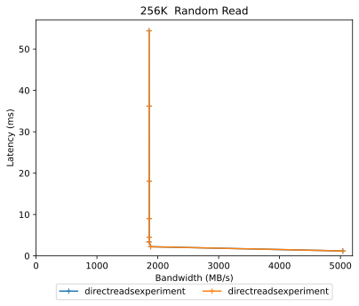
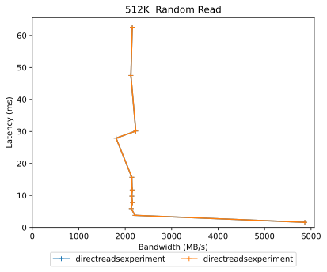
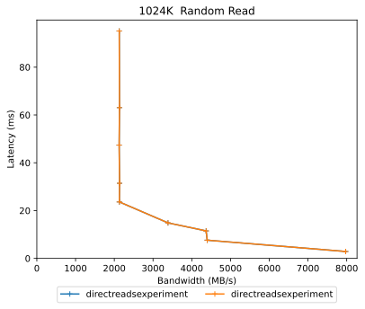

Comparitive Performance Report for directreadsexperiment vs directreadsexperiment
=================================================================================

Table of contents
=================

* [Comparison summary for directreadsexperiment vs directreadsexperiment](#comparison-summary-for-directreadsexperiment-vs-directreadsexperiment)
* [Response Curves](#response-curves)
	* [Random Read](#random-read)

# Comparison summary for directreadsexperiment vs directreadsexperiment
  
  
  
|Random Read|directreadsexperiment|directreadsexperiment|%change throughput|%change latency|  
| :--- | ---: | ---: | ---: | ---: |  
|[256K](#262144-randread)|5040 MB/s@1.2ms|5040 MB/s@1.2ms|0%|0%|  
|[512K](#524288-randread)|5867 MB/s@1.6ms|5867 MB/s@1.6ms|0%|0%|  
|[1024K](#1048576-randread)|7974 MB/s@2.9ms|7974 MB/s@2.9ms|0%|0%|  
  
  
  

# Response Curves

## Random Read

|||
| :---: | :---: |
|||
|||
