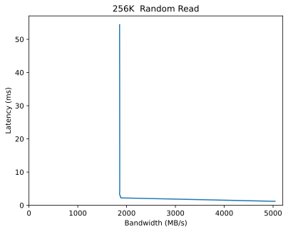

Performance Report for directreadsexperiment
============================================

Table of contents
=================

* [Summary of results for directreadsexperiment](#summary-of-results-for-directreadsexperiment)
* [Response Curves](#response-curves)
	* [Random Read](#random-read)

# Summary of results for directreadsexperiment
  
|Workload Name|Maximum Throughput|Latency (ms)|  
| :--- | ---: | ---: |  
|[262144_randread](#262144-randread)|5040 MB/s|1.2|  
|[524288_randread](#524288-randread)|5867 MB/s|1.6|  
|[1048576_randread](#1048576-randread)|7974 MB/s|2.9|
# Response Curves

## Random Read

|||
| :---: | :---: |
|||
|||
